# 第1天-四层负载均衡详解

## 一、集群概念

1、 集群（cluster）技术是一种较新的技术，通过集群技术，可以在付出较低成本的情况下获得在性能、可靠性、灵活性方面的相对较高的收益，其任务调度则是集群系统中的核心技术。

2、 集群是一组相互独立的、通过高速网络互联的计算机，它们构成了一个组，并以单一系统的模式加以管理。一个客户与集群相互作用时，集群像是一个独立的服务器。

3、 集群组成后，可以利用多个计算机和组合进行海量请求处理（**负载均衡**），从而获得很高的处理效率，也可以用多个计算机做备份（高可用），使得任何一个机器坏了整个系统还是能正常运行。集群在目前互联网公司是必备的技术，极大提高互联网业务的可用性和可缩放性。

## 二、负载均衡集群

负载均衡集群为企业需求提供了可解决容量问题的有效方案，使负载可以在计算机集群中尽可能平均地分摊处理。

负载通常包括应用程序处理负载和网络流量负载。这样的系统非常适合向使用同一组应用程序的大量用户提供服务。每个节点都可以承担一定的处理负载，并且可以实现处理负载在节点之间的动态分配，以实现负载均衡。对于网络流量负载,当网络服务程序接受了高入网流量，以致无法迅速处理，这时，网络流量就会发送给在其它节点上运行的网络服务程序。也可根据服务器的承载能力，进行服务请求的分发，从而使用户的请求得到更快速的处理。

**负载均衡技术类型：基于 4 层负载均衡技术和基于 7 层负载均衡技术**

**负载均衡实现方式：硬件负载均衡设备或者软件负载均衡**

**硬件负载均衡产品：F5 BIG-IP 、Citrix Netscaler  、深信服 、Array 、Radware**

**软件负载均衡产品： LVS（Linux Virtual Server）、 Haproxy、Nginx、Ats（apache traffic server）**


### 1、实现效果图

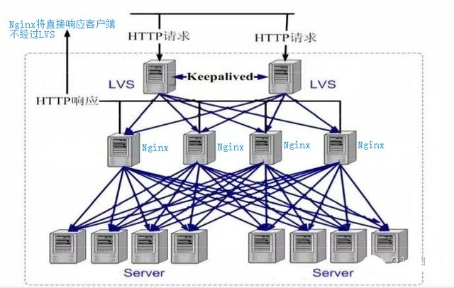


### 2、负载均衡分类

负载均衡根据所采用的设备对象（**软/硬件负载均衡**），应用的OSI网络层次（**网络层次上的负载均衡**），及应用的地理结构（**本地/全局负载均衡**）等来分类。本文着重介绍的是根据应用的 OSI 网络层次来分类的两个负载均衡类型。

我们先来看一张图，相信很多同学对这张图都不陌生，这是一张网络模型图，包含了 OSI 模型及 TCP/IP 模型，两个模型虽然有一点点区别，但主要的目的是一样的，模型图描述了通信是怎么进行的。它解决了实现有效通信所需要的所有过程，并将这些过程划分为逻辑上的层。层可以简单地理解成数据通信需要的步骤。

**根据负载均衡所作用在 OSI 模型的位置不同，负载均衡可以大概分为以下几类：**

- **二层负载均衡（mac）**

  根据OSI模型分的二层负载，一般是用虚拟mac地址方式，外部对虚拟MAC地址请求，负载均衡接收后分配后端实际的MAC地址响应。

- **三层负载均衡（ip）**

  一般采用虚拟IP地址方式，外部对虚拟的ip地址请求，负载均衡接收后分配后端实际的IP地址响应。

- **四层负载均衡（tcp）**

  在三层负载均衡的基础上，用ip+port接收请求，再转发到对应的机器。

- **七层负载均衡（http）**

  根据虚拟的url或IP，主机名接收请求，再转向相应的处理服务器。

在实际应用中，比较常见的就是四层负载及七层负载。这里也重点说下这两种负载。

### 3、四层负载均衡

基于IP+端口的负载均衡

所谓四层负载均衡，也就是主要通过报文中的目标地址和端口，再加上负载均衡设备设置的服务器选择方式，决定最终选择的内部服务器。

layer4

1. 在三层负载均衡的基础上，通过发布三层的IP地址（VIP），然后加四层的端口号，来决定哪些流量需要做负载均衡，对需要处理的流量进行NAT处理，转发至后台服务器，并记录下这个TCP或者UDP的流量是由哪台服务器处理的，后续这个连接的所有流量都同样转发到同一台服务器处理。
2. 以常见的TCP为例，负载均衡设备在接收到第一个来自客户端的SYN 请求时，即通过上述方式选择一个最佳的服务器，并对报文中目标IP地址进行修改(改为后端服务器IP），直接转发给该服务器。TCP的连接建立，即三次握手是客户端和服务器直接建立的，负载均衡设备只是起到一个类似路由器的转发动作。在某些部署情况下，为保证服务器回包可以正确返回给负载均衡设备，在转发报文的同时可能还会对报文原来的源地址进行修改。
3. 对应的负载均衡器称为四层交换机（L4 switch），主要分析IP层及TCP/UDP层，实现四层负载均衡。此种负载均衡器不支持应用协议（如HTTP/FTP/MySQL等等）
   要处理的流量进行NAT处理，转发至后台服务器，并记录下这个TCP或者UDP的流量是由哪台服务器处理的，后续这个连接的所有流量都同样转发到同一台服务器处理。
4. 实现四层负载均衡的软件有：
   - F5：硬件负载均衡器，功能很好，但是成本很高。
   - lvs：重量级的四层负载软件
   - nginx：轻量级的四层负载软件，带缓存功能，正则表达式较灵活
   - haproxy：模拟四层转发，较灵活

### 4、七层的负载均衡

基于虚拟的URL或主机IP的负载均衡

所谓七层负载均衡，也称为“内容交换”，也就是主要通过报文中的真正有意义的应用层内容，再加上负载均衡设备设置的服务器选择方式，决定最终选择的内部服务器。

layer7

1. 在四层负载均衡的基础上（没有四层是绝对不可能有七层的），再考虑应用层的特征，比如同一个Web服务器的负载均衡，除了根据VIP加80端口辨别是否需要处理的流量，还可根据七层的URL、浏览器类别、语言来决定是否要进行负载均衡。举个例子，如果你的Web服务器分成两组，一组是中文语言的，一组是英文语言的，那么七层负载均衡就可以当用户来访问你的域名时，自动辨别用户语言，然后选择对应的语言服务器组进行负载均衡处理。
2. 以常见的TCP为例，负载均衡设备如果要根据真正的应用层内容再选择服务器，只能先代理最终的服务器和客户端建立连接(三次握手)后，才可能接受到客户端发送的真正应用层内容的报文，然后再根据该报文中的特定字段，再加上负载均衡设备设置的服务器选择方式，决定最终选择的内部服务器。负载均衡设备在这种情况下，更类似于一个**代理服务器**。负载均衡和前端的客户端以及后端的服务器会分别建立TCP连接。所以从这个技术原理上来看，七层负载均衡明显的对负载均衡设备的要求更高，处理七层的能力也必然会低于四层模式的部署方式。
3. 对应的负载均衡器称为七层交换机（L7 switch），除了支持四层负载均衡以外，还有分析应用层的信息，如HTTP协议URI或Cookie信息，实现七层负载均衡。此种负载均衡器能理解应用协议。
4. 实现七层负载均衡的软件有：
   - haproxy：天生负载均衡技能，全面支持七层代理，会话保持，标记，路径转移；
   - nginx：只在http协议和mail协议上功能比较好，性能与haproxy差不多；
   - apache：功能较差
   - Mysql proxy：功能尚可。

### 5、四层负载与七层负载的区别

四层负载均衡就像银行的自助排号机，每一个达到银行的客户根据排号机的顺序，选择对应的窗口接受服务；而七层负载均衡像银行大堂经理，先确认客户需要办理的业务，再安排排号。这样办理理财、存取款等业务的客户，会根据银行内部资源得到统一协调处理，加快客户业务办理流程。


|          | 四层负载均衡（layer 4） | 七层负载均衡（layer 7）                          |
| -------- | ----------------------- | ------------------------------------------------ |
| 基于     | 基于IP  Port            | URL                                              |
| 类似于   | 路由器                  | 代理服务器                                       |
| 握手次数 | 1 次                    | 2 次                                             |
| 复杂度   | 低                      | 高                                               |
| 性能     | 高；无需解析内容        | 中；需要算法识别 URL，Cookie 和 HTTP head 等信息 |
| 安全性   | 低，无法识别 DDoS等攻击 | 高， 可以防御SYN cookie以SYN flood等             |
| 额外功能 | 无                      | 会话保持，图片压缩，防盗链等                     |


从上面的对比看来四层负载与七层负载最大的区别就是效率与功能的区别。四层负载架构设计比较简单，无需解析具体的消息内容，在网络吞吐量及处理能力上会相对比较高，而七层负载均衡的优势则体现在功能多，控制灵活强大。在具体业务架构设计时，使用七层负载或者四层负载还得根据具体的情况综合考虑。


## 三、LVS 实现四层负载均衡

### 1、LVS 介绍

（1）LVS 是` Linux Virtual Server`的简称，也就是 Linux 虚拟服务器, 是一个由章文嵩博士发起的自由软件项目，它的官方站点是**www.linuxvirtualserver.org。**现在LVS已经是 Linux标准内核的一部分，在Linux2.4内核以前，使用LVS时必须要重新编译内核以支持LVS功能模块，但是从Linux2.4内核以后，已经完全内置了LVS的各个功能模块，无需给内核打任何补丁，可以直接使用LVS提供的各种功能。

（2）LVS自从1998年开始，发展到现在已经是一个比较成熟的技术项目了。可以利用LVS技术实现高可伸缩的、高可用的网络服务，例如WWW服务、Cache服务、DNS服务、FTP服务、MAIL服务、视频/音频点播服务等等，有许多比较著名网站和组织都在使用LVS架设的集群系统，例如：Linux的门户网站（www.linux.com）、向RealPlayer提供音频视频服务而闻名的Real公司（www.real.com）、全球最大的开源网站（sourceforge.net）等。

**（3）LVS软件作用：通过LVS提供的负载均衡技术和Linux操作系统实现一个高性能、高可用的服务器群集，它具有良好可靠性、可扩展性和可操作性。从而以低廉的成本实现最优的服务性能。**


### 2、LVS 优势与不足

##### 1.优势

**高并发连接**：LVS基于内核网络层面工作，有超强的承载能力和并发处理能力。单台LVS负载均衡器，可支持上万并发连接。

**稳定性强：**是工作在网络4层之上仅作分发之用，这个特点也决定了它在负载均衡软件里的性能最强，稳定性最好，对内存和cpu资源消耗极低。

**成本低廉：**硬件负载均衡器少则十几万，多则几十万上百万，LVS只需一台服务器和就能免费部署使用，性价比极高。

**配置简单：**LVS配置非常简单，仅需几行命令即可完成配置，也可写成脚本进行管理。

**支持多种算法：**支持多种论调算法，可根据业务场景灵活调配进行使用

**支持多种工作模型：**可根据业务场景，使用不同的工作模式来解决生产环境请求处理问题。

应用范围广：因为LVS工作在4层，所以它几乎可以对所有应用做负载均衡，包括http、数据库、DNS、ftp服务等等

##### 2.不足

工作在4层，不支持7层规则修改，机制过于庞大，不适合小规模应用。

### 3、LVS 核心组件和专业术语

##### 1.核心组件

LVS的管理工具和内核模块 ipvsadm/ipvs

ipvsadm：用户空间的命令行工具，用于管理集群服务及集群服务上的RS等；

ipvs：工作于内核上的netfilter INPUT钩子之上的程序，可根据用户定义的集群实现请求转发；

##### 2.专业术语

**VS**：Virtual Server            #虚拟服务

**Director, Balancer**          #负载均衡器、分发器

**RS**：Real Server                #后端请求处理服务器 

**CIP**: Client IP                      #用户端IP

**VIP**：Director Virtual IP   #负载均衡器虚拟IP

**DIP**：Director IP               #负载均衡器IP

**RIP**：Real Server IP         #后端请求处理服务器IP

### 4、LVS工作内核模型及工作模式·

1、当客户端的请求到达负载均衡器的内核空间时，首先会到达 PREROUTING 链。

2、当内核发现请求数据包的目的地址是本机时，将数据包送往 INPUT 链。

3、LVS由用户空间的ipvsadm和内核空间的IPVS组成，ipvsadm用来定义规则，IPVS利用ipvsadm定义的规则工作，IPVS工作在INPUT链上,当数据包到达INPUT链时，首先会被IPVS检查，如果数据包里面的目的地址及端口没有在规则里面，那么这条数据包将被放行至用户空间。

4、如果数据包里面的目的地址及端口在规则里面，那么这条数据报文将被修改目的地址为事先定义好的后端服务器，并送往POSTROUTING链。

5、最后经由POSTROUTING链发往后端服务器。

图解

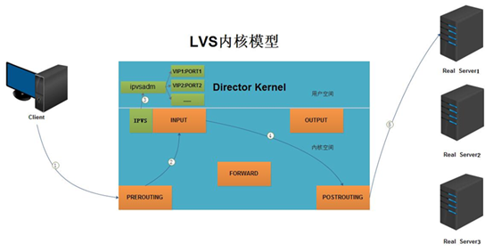

 

### 5、LVS负载均衡四种工作模式

##### 1、NAT工作模式

###### 1.LVS NAT 模式介绍

Virtual Server via NAT(VS-NAT):用地址转换实现虚拟服务器｡分发器有能被外界访问到的合法IP地址,它修改来自专有网络的流出包的地址｡外界看起来包是来自分发器本身,当外界包送到转换器时,它能判断出应该将包送到内部网的哪个节点｡优点是节省IP 地址,能对内部进行伪装;缺点是效率低,因为返回给请求方的流量经过转换器｡

###### 2.LVS NAT 模式工作流程

> 1、 当用户请求到达Director Server，此时请求的数据报文会先到内核空间的 PREROUTING链。 此时报文的源IP为CIP，目标IP为VIP
>
> 2、 PREROUTING检查发现数据包的目标IP是本机，将数据包送至INPUT链
>
> 3、IPVS比对数据包请求的服务是否为集群服务，若是，修改数据包的目标IP地址为后端服务器IP，然后将数据包发至POSTROUTING链。 此时报文的源IP为CIP，目标IP为RIP
>
> 4、POSTROUTING链通过选路，将数据包发送给Real Server
>
> 5、Real Server比对发现目标为自己的IP，开始构建响应报文发回给Director Server。 此时报文的源IP为RIP，目标IP为CIP
>
> 6、Director Server 把RS来到响应包，通过FORWORD 转发给client 在响应客户端前，此时会将源IP地址修改为自己的VIP地址，然后响应给客户端。 此时报文的源IP为VIP，目标IP为CIP

###### 3.LVS NET 模式图解

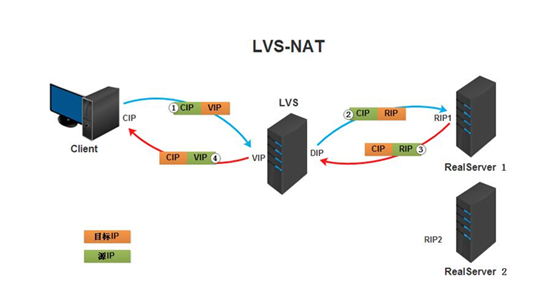

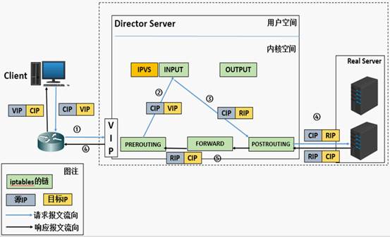

  

##### 2、DR 工作模式

###### 1.LVS DR 模式介绍

Virtual Server via Direct Routing(VS-DR):用直接路由技术实现虚拟服务器｡当参与集群的计算机和作为控制管理的计算机在**同一个网段时**可以用此方法,控制管理的计算机接收到请求包时直接送到参与集群的节点｡直接路由模式比较特别，很难说和什么方面相似，前种模式基本上都是工作在网络层上（三层），而直接路由模式则应该是工作在数据链路层上（二层）。

###### 2.LVS DR 模式工作原理 

DR和REAL SERVER都使用同一个IP对外服务。但只有DR对ARP请求进行响应，所有REAL SERVER对本身这个IP的ARP请求保持静默。也就是说，网关会把对这个服务IP的请求全部定向给DR，而DR收到数据包后根据调度算法，找出对应的 REAL SERVER，把目的MAC地址改为REAL SERVER的MAC并发给这台REAL SERVER。这时REAL SERVER收到这个数据包，则等于直接从客户端收到这个数据包无异，处理后直接返回给客户端。由于DR要对二层包头进行改换，所以DR和REAL SERVER之间必须在一个广播域，也可以简单的理解为在同一台交换机上

###### 3.LVS DR 模式工作流程

> 1、 当用户请求到达Director Server，此时请求的数据报文会先到内核空间的PREROUTING链。 此时报文的源IP为CIP，目标IP为VIP
>
> 2、 PREROUTING检查发现数据包的目标IP是本机，将数据包送至INPUT链
>
> 3、 IPVS比对数据包请求的服务是否为集群服务，若是，将请求报文中的源MAC地址修改为DIP的MAC地址，将目标MAC地址修改RIP的MAC地址，然后将数据包发至POSTROUTING链。 此时的源IP和目的IP均未修改，仅修改了源MAC地址为DIP的MAC地址，目标MAC地址为RIP的MAC地址
>
> 4、 由于DS和RS在同一个网络中，所以是通过二层，数据链路层来传输。POSTROUTING链检查目标MAC地址为RIP的MAC地址，那么此时数据包将会发至Real Server。
>
> 5、 RS发现请求报文的MAC地址是自己的MAC地址，就接收此报文。处理完成之后，将响应报文通过lo接口传送给eth0网卡然后向外发出。 此时的源IP地址为VIP，目标IP为CIP
>
> 6、 响应报文最终送达至客户端 

###### 4.LVS DR 模式特点

> 1、 保证前端路由将目标地址为VIP报文统统发给Director Server，而不是RS
>
> 2、 RS可以使用私有地址；也可以是公网地址，如果使用公网地址，此时可以通过互联网对RIP进行直接访问
>
> 3、 RS跟Director Server必须在同一个物理网络中
>
> 4、 所有的请求报文经由Director Server，但响应报文必须不能进过Director Server
>
> 5、 不支持地址转换，也不支持端口映射
>
> 6、 RS可以是大多数常见的操作系统
>
> 7、 RS的网关绝不允许指向DIP(因为我们不允许他经过director)
>
> 8、 RS上的lo接口配置VIP的IP地址

###### 5.LVS DR 模式工作流程图解

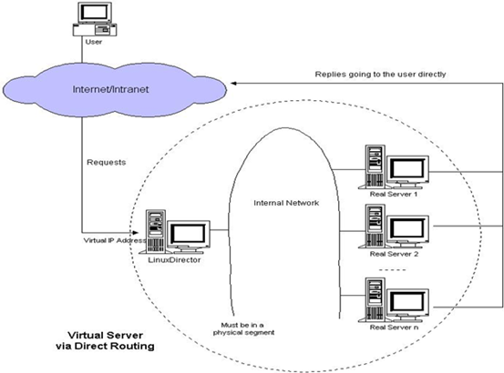

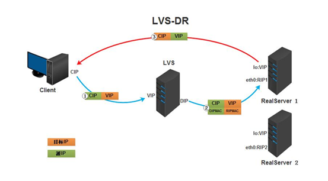

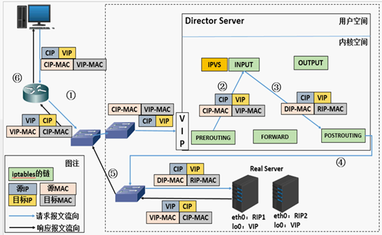

 

##### 3、LVS TUN 工作模式

###### 1.LVS TUN 模式介绍

用IP隧道技术实现虚拟服务器｡这种方式是在集群的节点不在同一个网段时可用的转发机制,是将IP包封装在其他网络流量中的方法｡为了安全的考虑,应该使用隧道技术中的VPN,也可使用租用专线｡ 集群所能提供的服务是基于TCP/IP的Web服务､Mail服务､News服务､DNS服务､Proxy服务器等等.

TUN模式:采用NAT技术时，由于请求和响应报文都必须经过调度器地址重写，当客户请求越来越多时，调度器的处理能力将成为瓶颈。为了解决这个问题，调度器把请求报文通过IP隧道转发至真实服务器，而真实服务器将响应直接返回给客户，所以调度器只处理请求报文。由于一般网络服务应答比请求报文大许多，采用 VS/TUN技术后，集群系统的最大吞吐量可以提高10倍

###### 2.LVS TUN 模式工作流程

> 1、 客户端将请求发往前端的负载均衡器，请求报文源地址是CIP，目标地址为VIP。
>
> 2、 负载均衡器收到报文后，发现请求的是在规则里面存在的地址，那么它将在客户端请求报文的首部再封装一层IP报文,将源地址改为DIP，目标地址改为RIP,并将此包发送给RS。
>
> 3、 RS收到请求报文后，会首先拆开第一层封装,然后发现里面还有一层IP首部的目标地址是自己lo接口上的VIP，所以会处理次请求报文，并将响应报文**通过lo接口送给eth0网卡直接发送给客户端**。注意：需要设置lo接口的VIP不能在共网上出现 

###### 3.LVS TUN 模式图解

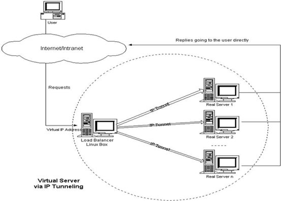

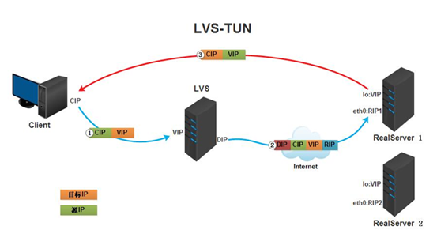

 

##### 4、LVS full-nat 工作模式

lvs-fullnat（双向转换）

通过请求报文的源地址为DIP，目标为RIP来实现转发：对于响应报文而言，修改源地址为VIP，目标地址为CIP来实现转发：

​          CIP --> DIP           VIP --> RIP

架构特点：这是一种对nat模型的改进，是一个扩展，使得RS与Director可以处于不同网络。

（1）RIP，DIP可以使用私有地址；

（2）RIP和DIP可以不再同一个网络中，且RIP的网关未必需要指向DIP；

（3）支持端口映射；

（4）RS的OS可以使用任意类型；

（5）请求报文经由Director，响应报文也经由Director

 

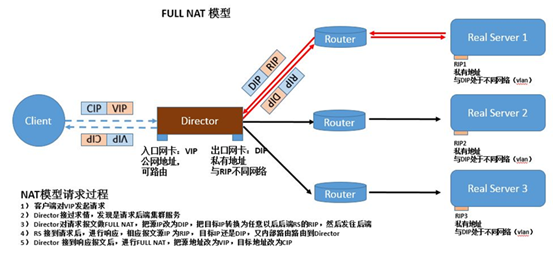

 

##### 5、四者的区别

| 机器名称   | IP配置                             | 服务角色   | 备注                               |
| ---------- | ---------------------------------- | ---------- | ---------------------------------- |
| lvs-server | VIP:172.16.100.1 DIP:192.168.100.1 | 负载均衡器 | 开启路由功能（VIP桥接、DIP仅主机） |
| rs01       | RIP：192.168.100.2                 | 后端服务器 | 网关指向DIP（仅主机）              |
| rs02       | RIP：192.168.100.3                 | 后端服务器 | 网关指向DIP（仅主机）              |
| rs03       | RIP：192.168.100.4                 | 后端服务器 | 网关指向DIP（仅主机）              |


lvs-nat与lvs-fullnat：请求和响应报文都经由Director

   　　lvs-nat：RIP的网关要指向DIP

  　　 lvs-fullnat：RIP和DIP未必在同一IP网络，但要能通信

lvs-dr与lvs-tun：请求报文要经由Director，但响应报文由RS直接发往Client

  　　 lvs-dr：通过封装新的MAC首部实现，通过MAC网络转发

  　　 lvs-tun：通过在原IP报文外封装新IP头实现转发，支持远距离通信 

#### 6、LVS ipvsadm 命令的使用

##### 1、LVS-server 安装 lvs 管理软件

```shell
[root@qfedu.com ~]# yum -y install ipvsadm
```

程序包：ipvsadm（LVS管理工具）

Unit File: ipvsadm.service

主程序：/usr/sbin/ipvsadm

规则保存工具：/usr/sbin/ipvsadm-save

规则重载工具：/usr/sbin/ipvsadm-restore

配置文件：/etc/sysconfig/ipvsadm-config

##### 2、命令选项

```shell
-A --add-service #在服务器列表中新添加一条新的虚拟服务器记录
-t #表示为tcp服务
-u #表示为udp服务
-s --scheduler #使用的调度算法， rr | wrr | lc | wlc | lblb | lblcr | dh | sh | sed | nq 默认调度算法是 wlc
例：ipvsadm -A -t 192.168.1.2:80 -s wrr

-a --add-server  #在服务器表中添加一条新的真实主机记录
-t --tcp-service #说明虚拟服务器提供tcp服务
-u --udp-service #说明虚拟服务器提供udp服务
-r --real-server #真实服务器地址
-m --masquerading #指定LVS工作模式为NAT模式
-w --weight #真实服务器的权值
-g --gatewaying #指定LVS工作模式为直接路由器模式（也是LVS默认的模式）
-i --ip #指定LVS的工作模式为隧道模式
-p #会话保持时间，定义流量被转到同一个realserver的会话存留时间
例：ipvsadm -a -t 192.168.1.2:80 -r 192.168.2.10:80 -m -w 1

-E -edit-service #编辑内核虚拟服务器表中的一条虚拟服务器记录。
-D -delete-service #删除内核虚拟服务器表中的一条虚拟服务器记录。
-C -clear #清除内核虚拟服务器表中的所有记录。
-R -restore #恢复虚拟服务器规则
-S -save #保存虚拟服务器规则，输出为-R 选项可读的格式
-e -edit-server #编辑一条虚拟服务器记录中的某条真实服务器记录
-d -delete-server #删除一条虚拟服务器记录中的某条真实服务器记录
-L|-l –list #显示内核虚拟服务器表

--numeric, -n：#以数字形式输出地址和端口号
--exact： #扩展信息，精确值 
--connection，-c： #当前IPVS连接输出
--stats： #统计信息
--rate ： #输出速率信息

参数也可以从/proc/net/ip_vs*映射文件中查看
-Z –zero #虚拟服务表计数器清零（清空当前的连接数量等）
```

#### 7、实现 LVS 持久连接

##### 1、定义 

由于HTTP是一种无状态协议，每次请求完毕之后就立即断开了，当用户浏览购物网站挑选商品的时候，看到一件商品加入购物车，此过程被重定向到了REALSERVER1上面来，当把第二件商品加入购物车又被重定向到了REALSERVER2上面，最后结账的时候在REALSERVER2上面，只有一件商品，这显然是用户无法接受的，此时就需要一种持久连接机制，来把同一用户的HTTP请求在超时时间内都重定向到同一台REALSERVER，超时时间可以自己定义，比如说2个小时，在超时时间内服务器会不断追踪用户的访问请求，把某一用户的所有请求都转发到同一台REALSERVER上面

对于电子商务网站来说，用户在挑选商品的时候使用的是80端口来浏览的，当付款的时候则是通过443的ssl加密的方式，当然当用户挑选完商品付款的时候我们当然不希望https的443跳转到另外一台REALSERVER，很显然应该是同一REALSERVER才对，这时候就要用到基于防火墙标记的持久连接，通过定义端口的姻亲关系来实现 

##### 2、功能

无论ipvs使用何种scheduler，其都能够实现在指定时间范围内始终将来自同一个ip地址的请求发往同一个RS；此功能是通过lvs持久连接模板实现，其与调度方法无关；

```shell
[root@qfedu.com ~]# iptables -t mangle -A PREROUTING -d 172.16.100.100 -p tcp --dport 80 -j MARK --set-mark 99
```

\#在iptables 打上标记，把80端口标记为99

```shell
[root@qfedu.com ~]# iptables -t mangle -A PREROUTING -d 172.16.100.100-p tcp --dport 443 -j MARK --set-mark 99
```

\#在iptables打上标记，把443端口标记为99

```shell
[root@qfedu.com ~]# ipvsadm -A -f 99 -s rr -p
```

在lvs上建立基于99号标记的虚拟服务

```shell
[root@qfedu.com ~]# ipvsadm -a -f 99 -r 172.16.100.2 -g
```

设置后端服务地址

```shell
[root@qfedu.com ~]# ipvsadm -a -f 99 -r 172.16.100.3 -g
```

#### 8、LVS的调度算法

LVS的调度算法分为静态与动态两类。

##### 1、静态算法（4种）

只根据算法进行调度 而不考虑后端服务器的实际连接情况和负载情况

**1、RR**：轮叫调度（Round Robin）

　 调度器通过”轮叫”调度算法将外部请求按顺序轮流分配到集群中的真实服务器上，它均等地对待每一台服务器，而不管服务器上实际的连接数和系统负载｡

**2、WRR**：加权轮叫（Weight RR）

　 调度器通过“加权轮叫”调度算法根据真实服务器的不同处理能力来调度访问请求。这样可以保证处理能力强的服务器处理更多的访问流量。调度器可以自动问询真实服务器的负载情况,并动态地调整其权值。

**3、DH**：目标地址散列调度（Destination Hash ）

　 根据请求的目标IP地址，作为散列键(HashKey)从静态分配的散列表找出对应的服务器，若该服务器是可用的且未超载，将请求发送到该服务器，否则返回空。

**4、SH**：源地址 hash（Source Hash）

　 源地址散列”调度算法根据请求的源IP地址，作为散列键(HashKey)从静态分配的散列表找出对应的服务器，若该服务器是可用的且未超载，将请求发送到该服务器，否则返回空｡

##### 2、动态算法（6种）

前端的调度器会根据后端真实服务器的实际连接情况来分配请求

**1、LC**：最少链接（Least Connections）

　 调度器通过”最少连接”调度算法动态地将网络请求调度到已建立的链接数最少的服务器上。如果集群系统的真实服务器具有相近的系统性能，采用”最小连接”调度算法可以较好地均衡负载。

**2、WLC**：加权最少连接(默认采用的就是这种)（Weighted Least Connections）

　 在集群系统中的服务器性能差异较大的情况下，调度器采用“加权最少链接”调度算法优化负载均衡性能，具有较高权值的服务器将承受较大比例的活动连接负载｡调度器可以自动问询真实服务器的负载情况,并动态地调整其权值。

**3、SED**：最短期望延迟调度（Shortest Expected Delay ）

　 在WLC基础上改进，Overhead =  （ACTIVE+1）*256/加权，不再考虑非活动状态，把当前处于活动状态的数目+1来实现，数目最小的，接受下次请求，+1的目的是为了考虑加权的时候，非活动连接过多缺陷：当权限过大的时候，会倒置空闲服务器一直处于无连接状态。

**4、NQ**：永不排队/最少队列调度（Never Queue Scheduling NQ）

　 无需队列。如果有台  realserver的连接数＝0就直接分配过去，不需要再进行sed运算，保证不会有一个主机很空间。在SED基础上无论+几，第二次一定给下一个，保证不会有一个主机不会很空闲着，不考虑非活动连接，才用NQ，SED要考虑活动状态连接，对于DNS的UDP不需要考虑非活动连接，而httpd的处于保持状态的服务就需要考虑非活动连接给服务器的压力。

**5、LBLC**：基于局部性的最少链接（locality-Based Least Connections）

　  基于局部性的最少链接”调度算法是针对目标IP地址的负载均衡，目前主要用于Cache集群系统｡该算法根据请求的目标IP地址找出该目标IP地址最近使用的服务器，若该服务器是可用的且没有超载，将请求发送到该服务器;若服务器不存在，或者该服务器超载且有服务器处于一半的工作负载，则用“最少链接”的原则选出一个可用的服务器，将请求发送到该服务器｡

**6、LBLCR**：带复制的基于局部性最少连接（Locality-Based Least Connections with Replication）

　   带复制的基于局部性最少链接”调度算法也是针对目标IP地址的负载均衡，目前主要用于Cache集群系统｡它与LBLC算法的不同之处是它要维护从一个目标IP地址到一组服务器的映射，而LBLC算法维护从一个目标IP地址到一台服务器的映射｡该算法根据请求的目标IP地址找出该目标IP地址对应的服务器组，按”最小连接”原则从服务器组中选出一台服务器，若服务器没有超载，将请求发送到该服务器；若服务器超载，则按“最小连接”原则从这个集群中选出一台服务器，将该服务器加入到服务器组中，将请求发送到该服务器｡同时，当该服务器组有一段时间没有被修改，将最忙的服务器从服务器组中删除，以降低复制的程度。

## 三、LVS NAT 模式搭建【扩展】

**三台服务器A、B、C：**

### 1、 A: load balancer

（调度器dir，分发器） 在虚拟机设置里添加新网卡并设为仅主机模式连接，查看IP

内网网卡：192.168.31.128，网关保持不变（192.168.31.2）

外网网卡：192.168.229.128，不用设置，重启网络即可，此地址跟网卡设置里看到的地址保持一致

```shell
[root@qfedu.com ~]# setenforce 0 # 关闭selinux
[root@qfedu.com ~]# systemctl stop firewalld # 停止firewalld
[root@qfedu.com ~]# systemctl disable firewalld # 关闭firewalld
[root@qfedu.com ~]# yum install -y iptables-services # 安装iptables
[root@qfedu.com ~]# systemctl enable iptables # 添加iptables服务
[root@qfedu.com ~]# service iptables start # 启动iptables服务
[root@qfedu.com ~]# iptables -F # 清空iptables规则
[root@qfedu.com ~]# service iptables save # 保存空规则
```

#### 1、创建 LVS 的 NAT 规则脚本

```shell
[root@qfedu.com ~]# vim /usr/local/sbin/lvs_nat.sh
#! /bin/bash
# director 服务器上开启路由转发功能
[root@qfedu.com ~]# echo 1 > /proc/sys/net/ipv4/ip_forward
# 关闭icmp的重定向，开启icmp则无法将数据包转发至real server上，也无法返回
[root@qfedu.com ~]# echo 0 > /proc/sys/net/ipv4/conf/all/send_redirects
[root@qfedu.com ~]# echo 0 > /proc/sys/net/ipv4/conf/default/send_redirects
[root@qfedu.com ~]# echo 0 > /proc/sys/net/ipv4/conf/eth0/send_redirects
[root@qfedu.com ~]# echo 0 > /proc/sys/net/ipv4/conf/ens37/send_redirects
# director 设置nat防火墙
[root@qfedu.com ~]# iptables -t nat -F 清空所有规则
[root@qfedu.com ~]# iptables -t nat -X 清空所有链
[root@qfedu.com ~]# iptables -t nat -A POSTROUTING -s 192.168.31.0/24 -j MASQUERADE 增加路由转发规则
# director设置ipvsadm变量
IPVSADM='/usr/sbin/ipvsadm'
$IPVSADM -C # 清空所有规则
$IPVSADM -A -t 192.168.229.128:80 -s wlc -p 3 # 保持登陆时限persistent 设为0会报错
# 访问规则，-A指定转发模式，-t指定分发器ip， -s指定调度算法（rr,wrr,wlc,lc）-p登陆保持时限，3秒
$IPVSADM -a -t 192.168.229.128:80 -r 192.168.31.129:80 -m -w 1
# 转发规则，-a指定转发规则 -t指定director ip，-r指定real server ip -m指定NAT模式（masquerade） -w指定权重为1
$IPVSADM -a -t 192.168.229.128:80 -r 192.168.31.130:80 -m -w 1
# 转发规则，-a指定转发规则 -t指定director ip，-r指定real server ip -m指定NAT模式（masquerade） -w指定权重为1
```

#### 2、给脚本设权

```shell
[root@qfedu.com ~]# chmod 755 /usr/local/sbin/lvs_nat.sh
```

#### 3、执行脚本

```shell
[root@qfedu.com ~]# sh /usr/local/sbin/lvs_nat.sh
```

**排错：**当给主规则的登陆保持时限（persistent）设为0时，执行脚本会报错

```shell
[root@qfedu.com ~]# /usr/local/sbin/lvs_nat.sh
invalid timeout value `0' specified
Memory allocation problem
```

### 2、B: real server

 （web服务器） 内网网卡：192.168.31.129 网关改为129.168.31.128

安装nginx，并启动，在默认主页里写入，real server 1 关闭selinux，清空防火墙规则

### 3、C: real server

（web服务器） 内网网卡：192.168.31.130 网关改为129.168.31.128

安装nginx，并启动，在默认主页里写入，real server 2 关闭selinux，清空防火墙规则

### 4、测试

浏览器里访问192.168.229.128，（A主机外网网卡地址）多刷新几次看结果，服务器的切换。

浏览器上因为有本地缓存的原因，虽已经设定了登陆保持时限为1秒，但每次刷新都会保持在real server 2主机上。可以在调度机里用 curl 192.168.229.128 测试访问，调度算法采用rr，效果更明显。

#### 1、用 ipvsadm 命令查看转发规则

```shell
[root@qfedu.com ~]# ipvsadm -ln
IP Virtual Server version 1.2.1 (size=4096)
Prot LocalAddress:Port Scheduler Flags
-> RemoteAddress:Port Forward Weight ActiveConn InActConn
TCP 192.168.229.128:80 wlc persistent 1
-> 192.168.31.129:80 Masq 1 0 0
-> 192.168.31.130:80 Masq 1 0 0
```

#### 2、查看 iptables nat 链的转发规则

```shell
[root@qfedu.com ~]# iptables -t nat -nvL
Chain PREROUTING (policy ACCEPT 26 packets, 4015 bytes)
pkts bytes target prot opt in out source destination

Chain INPUT (policy ACCEPT 0 packets, 0 bytes)
pkts bytes target prot opt in out source destination

Chain OUTPUT (policy ACCEPT 2 packets, 404 bytes)
pkts bytes target prot opt in out source destination

Chain POSTROUTING (policy ACCEPT 1 packets, 328 bytes)
pkts bytes target prot opt in out source destination
7 532 MASQUERADE all -- * * 192.168.31.0/24 0.0.0.0/0
```

## **四、LVS DR 模式搭建**

**三台服务器A、B、C：**

### 1、A: load balancer

（调度器dir，分发器）

内网网卡：192.168.31.128，网关保持不变（192.168.31.2）

外网网卡：192.168.229.128，先不用理会，这里用不到

```shell
[root@a.qfedu.com ~]# setenforce 0 # 关闭selinux
[root@a.qfedu.com ~]# systemctl stop firewalld # 停止firewalld
[root@a.qfedu.com ~]# systemctl disable firewalld # 关闭firewalld
[root@a.qfedu.com ~]# yum install -y iptables-services # 安装iptables
[root@a.qfedu.com ~]# systemctl enable iptables # 添加iptables服务
[root@a.qfedu.com ~]# systemctl start iptables.service # 启动iptables服务
[root@a.qfedu.com ~]# iptables -F # 清空iptables规则
[root@a.qfedu.com ~]# service iptables save # 保存空规则
[root@a.qfedu.com ~]# yum -y install ipvsadm net-tools
```

#### 1、创建 LVS 的 DR 规则脚本

```shell
写入以下内容：
[root@qfedu.com ~]# vim /usr/local/sbin/lvs_dr.sh
echo 1 > /proc/sys/net/ipv4/ip_forward # 打开路由转发
ipv=/usr/sbin/ipvsadm # 设置ipvsadm变量
vip=192.168.31.200 # 设置公用ip变量（virtual ip）
rs1=192.168.31.129 # 设置real server1ip的变量
rs2=192.168.31.130 # 设置real server2ip的变量
ifdown eth0 # 关闭网卡
ifup eth0 # 启动网卡，目的时清空临时设定的ip，避免重复设定
ifconfig eth0:2 $vip broadcast $vip netmask 255.255.255.255 up # 绑定vip到虚拟网卡eth0:2上
route add -host $vip dev eth0:2 # 为eth0:2网卡添加网关
$ipv -C # 清空规则
$ipv -A -t $vip:80 -s wrr # -A指定转发模式，-t指定director ip，-s指定调度算法 wrr加权轮询调度
$ipv -a -t $vip:80 -r $rs1:80 -g -w 1
# 指定转发规则，-a指定转发规则，-t指定调度器(director)ip，-r指定real server IP，-g指定转发模式为DR(gateway) -w指定权重
$ipv -a -t $vip:80 -r $rs2:80 -g -w 1
# 指定转发规则，-a指定转发规则，-t指定调度器(director)ip，-r指定real server IP，-g指定转发模式为DR(gateway) -w指定权重

例子：
#!/bin/bash
echo 1 > /proc/sys/net/ipv4/ip_forward
ipv=/usr/sbin/ipvsadm
vip=192.168.152.200
rs1=192.168.152.132
rs2=192.168.152.133
ifdown eth0
ifup eth0
ifconfig eth0:2 $vip broadcast $vip netmask 255.255.255.255 up
route add -host $vip dev eth0:2
$ipv -C
$ipv -A -t $vip:80 -s wrr
$ipv -a -t $vip:80 -r $rs1:80 -g -w 1
$ipv -a -t $vip:80 -r $rs2:80 -g -w 1
```

#### 2、给脚本设权

```shell
[root@a.qfedu.com ~]# chmod 755 /usr/local/sbin/lvs_dr.sh
```

#### 3、执行脚本

```shell
[root@a.qfedu.com ~]# sh /usr/local/sbin/lvs_dr.sh
```

#### 4、查看路由上的 vip

```
[root@a.qfedu.com ~]# route -n
```

#### 5、查看网卡 eth0 上的 vip

```
[root@a.qfedu.com ~]# ip addr
```

### 2、B: real server 

（web服务器） 内网网卡：192.168.31.129 网关改回129.168.31.2

安装nginx，并启动，在默认主页里写入，real server 1 关闭selinux，清空防火墙规则

#### 1、创建转发脚本

```shell
[root@b.qfedu.com ~]# yum -y install net-tools

[root@b.qfedu.com ~]# vim /usr/local/sbin/lvs_rs.sh

写入以下内容：
#/bin/bash
vip=192.168.31.200
#把vip绑定在lo上，是为了实现rs直接把结果返回给客户端
ifdown lo
ifup lo
ifconfig lo:0 $vip broadcast $vip netmask 255.255.255.255 up绑定vip到虚拟网卡lo:0上
route add -host $vip lo:0为lo:0网卡添加网关
#以下操作为更改arp内核参数，目的是为了让rs顺利发送mac地址给客户端
echo "1" >/proc/sys/net/ipv4/conf/lo/arp_ignore
echo "2" >/proc/sys/net/ipv4/conf/lo/arp_announce
echo "1" >/proc/sys/net/ipv4/conf/all/arp_ignore
echo "2" >/proc/sys/net/ipv4/conf/all/arp_announce

arp_ignore:定义对目标地址为本地IP的ARP询问不同的应答模式0 
0 - (默认值): 回应任何网络接口上对任何本地IP地址的arp查询请求 
1 - 只回答目标IP地址是来访网络接口本地地址的ARP查询请求 
2 -只回答目标IP地址是来访网络接口本地地址的ARP查询请求,且来访IP必须在该网络接口的子网段内 
3 - 不回应该网络界面的arp请求，而只对设置的唯一和连接地址做出回应 
4-7 - 保留未使用 
8 -不回应所有（本地地址）的arp查询

arp_announce:对网络接口上，本地IP地址的发出的，ARP回应，作出相应级别的限制: 确定不同程度的限制,宣布对来自本地源IP地址发出Arp请求的接口 
0 - (默认) 在任意网络接口（eth0,eth1，lo）上的任何本地地址 
1 -尽量避免不在该网络接口子网段的本地地址做出arp回应. 当发起ARP请求的源IP地址是被设置应该经由路由达到此网络接口的时候很有用.此时会检查来访IP是否为所有接口上的子网段内ip之一.如果改来访IP不属于各个网络接口上的子网段内,那么将采用级别2的方式来进行处理. 
2 - 对查询目标使用最适当的本地地址.在此模式下将忽略这个IP数据包的源地址并尝试选择与能与该地址通信的本地地址.首要是选择所有的网络接口的子网中外出访问子网中包含该目标IP地址的本地地址. 如果没有合适的地址被发现,将选择当前的发送网络接口或其他的有可能接受到该ARP回应的网络接口来进行发送.

关于对arp_announce 理解的一点补充
其实就是路由器的问题，因为路由器一般是动态学习ARP包的（一般动态配置DHCP的话），当内网的机器要发送一个到外部的ip包，那么它就会请求 路由器的Mac地址，发送一个arp请求，这个arp请求里面包括了自己的ip地址和Mac地址，而linux默认是使用ip的源ip地址作为arp里面 的源ip地址，而不是使用发送设备上面的 ，这样在lvs这样的架构下，所有发送包都是同一个VIP地址，那么arp请求就会包括VIP地址和设备 Mac，而路由器收到这个arp请求就会更新自己的arp缓存，这样就会造成ip欺骗了，VIP被抢夺，所以就会有问题。 
arp缓存为什么会更新了，什么时候会更新呢，为了减少arp请求的次数，当主机接收到询问自己的arp请求的时候，就会把源ip和源Mac放入自 己的arp表里面，方便接下来的通讯。如果收到不是询问自己的包（arp是广播的，所有人都收到），就会丢掉，这样不会造成arp表里面无用数据太多导致 有用的记录被删除。  
在设置参数的时候将arp_ignore 设置为1，意味着当别人的arp请求过来的时候，如果接收的设备上面没有这个ip，就不做出响应，默认是0，只要这台机器上面任何一个设备上面有这个ip，就响应arp请求，并发送mac地址

例子：
#/bin/bash
vip=192.168.152.200
ifdown lo
ifup lo
ifconfig lo:0 $vip broadcast $vip netmask 255.255.255.255 up
route add -host $vip lo:0
echo "1" >/proc/sys/net/ipv4/conf/lo/arp_ignore
echo "2" >/proc/sys/net/ipv4/conf/lo/arp_announce
echo "1" >/proc/sys/net/ipv4/conf/all/arp_ignore
echo "2" >/proc/sys/net/ipv4/conf/all/arp_announce
```

#### 2、给脚本设权

```shell
[root@b.qfedu.com ~]# chmod 755 /usr/local/sbin/lvs_rs.sh
```

#### 3、执行脚本

```shell
[root@b.qfedu.com ~]# sh /usr/local/sbin/lvs_rs.sh
```

#### 4、查看路由上的 vip

```shell
[root@b.qfedu.com ~]# route -n
```

#### 5、查看网卡 lo 上的 vip

```shell
[root@b.qfedu.com ~]# ip addr
```

### 3、C: real server 

（web服务器） 内网网卡：192.168.31.130 网关改回129.168.31.2

安装nginx，并启动，在默认主页里写入，real server 2 关闭selinux，清空防火墙规则

#### 1、创建转发脚本

```shell
[root@c.qfedu.com ~]# yum -y install net-tools

[root@c.qfedu.com ~]# vim /usr/local/sbin/lvs_rs.sh

写入以下内容：
#/bin/bash
vip=192.168.31.200
#把vip绑定在lo上，是为了实现rs直接把结果返回给客户端
ifdown lo
ifup lo
ifconfig lo:0 $vip broadcast $vip netmask 255.255.255.255 up绑定vip到虚拟网卡lo:0上
route add -host $vip lo:0为lo:0网卡添加网关
#以下操作为更改arp内核参数，目的是为了让rs顺利发送mac地址给客户端
echo "1" >/proc/sys/net/ipv4/conf/lo/arp_ignore
echo "2" >/proc/sys/net/ipv4/conf/lo/arp_announce
echo "1" >/proc/sys/net/ipv4/conf/all/arp_ignore
echo "2" >/proc/sys/net/ipv4/conf/all/arp_announce

arp_ignore:定义对目标地址为本地IP的ARP询问不同的应答模式0 
0 - (默认值): 回应任何网络接口上对任何本地IP地址的arp查询请求 
1 - 只回答目标IP地址是来访网络接口本地地址的ARP查询请求 
2 -只回答目标IP地址是来访网络接口本地地址的ARP查询请求,且来访IP必须在该网络接口的子网段内 
3 - 不回应该网络界面的arp请求，而只对设置的唯一和连接地址做出回应 
4-7 - 保留未使用 
8 -不回应所有（本地地址）的arp查询

arp_announce:对网络接口上，本地IP地址的发出的，ARP回应，作出相应级别的限制: 确定不同程度的限制,宣布对来自本地源IP地址发出Arp请求的接口 
0 - (默认) 在任意网络接口（eth0,eth1，lo）上的任何本地地址 
1 -尽量避免不在该网络接口子网段的本地地址做出arp回应. 当发起ARP请求的源IP地址是被设置应该经由路由达到此网络接口的时候很有用.此时会检查来访IP是否为所有接口上的子网段内ip之一.如果改来访IP不属于各个网络接口上的子网段内,那么将采用级别2的方式来进行处理. 
2 - 对查询目标使用最适当的本地地址.在此模式下将忽略这个IP数据包的源地址并尝试选择与能与该地址通信的本地地址.首要是选择所有的网络接口的子网中外出访问子网中包含该目标IP地址的本地地址. 如果没有合适的地址被发现,将选择当前的发送网络接口或其他的有可能接受到该ARP回应的网络接口来进行发送.

关于对arp_announce 理解的一点补充
其实就是路由器的问题，因为路由器一般是动态学习ARP包的（一般动态配置DHCP的话），当内网的机器要发送一个到外部的ip包，那么它就会请求 路由器的Mac地址，发送一个arp请求，这个arp请求里面包括了自己的ip地址和Mac地址，而linux默认是使用ip的源ip地址作为arp里面 的源ip地址，而不是使用发送设备上面的 ，这样在lvs这样的架构下，所有发送包都是同一个VIP地址，那么arp请求就会包括VIP地址和设备 Mac，而路由器收到这个arp请求就会更新自己的arp缓存，这样就会造成ip欺骗了，VIP被抢夺，所以就会有问题。 
arp缓存为什么会更新了，什么时候会更新呢，为了减少arp请求的次数，当主机接收到询问自己的arp请求的时候，就会把源ip和源Mac放入自 己的arp表里面，方便接下来的通讯。如果收到不是询问自己的包（arp是广播的，所有人都收到），就会丢掉，这样不会造成arp表里面无用数据太多导致 有用的记录被删除。  
在设置参数的时候将arp_ignore 设置为1，意味着当别人的arp请求过来的时候，如果接收的设备上面没有这个ip，就不做出响应，默认是0，只要这台机器上面任何一个设备上面有这个ip，就响应arp请求，并发送mac地址

例子：
#/bin/bash
vip=192.168.152.200
ifdown lo
ifup lo
ifconfig lo:0 $vip broadcast $vip netmask 255.255.255.255 up
route add -host $vip lo:0
echo "1" >/proc/sys/net/ipv4/conf/lo/arp_ignore
echo "2" >/proc/sys/net/ipv4/conf/lo/arp_announce
echo "1" >/proc/sys/net/ipv4/conf/all/arp_ignore
echo "2" >/proc/sys/net/ipv4/conf/all/arp_announce
```

#### 2、给脚本设权

```shell
[root@c.qfedu.com ~]# chmod 755 /usr/local/sbin/lvs_rs.sh
```

#### 3、执行脚本

```shell
[root@c.qfedu.com ~]# sh /usr/local/sbin/lvs_rs.sh
```

#### 4、查看路由上的 vip

```shell
[root@c.qfedu.com ~]# route -n
```

#### 5、查看网卡 lo 上的 vip

```shell
[root@c.qfedu.com ~]# ip addr
```

### 4、测试

浏览器里访问192.168.31.200，（vip:vitrual ip）多刷新几次看结果，服务器的切换。

浏览器上因为有本地缓存的原因，虽已经设定了登陆保持时限为1秒，但每次刷新都会保持在real server 2主机上。可以在调度机里用 curl 192.168.31.200 测试访问，调度算法采用rr，效果更明显。

#### 1、用 ipvsadm 命令查看转发规则

```shell
[root@a.qfedu.com  ~]# ipvsadm -ln
IP Virtual Server version 1.2.1 (size=4096)
Prot LocalAddress:Port Scheduler Flags
-> RemoteAddress:Port Forward Weight ActiveConn InActConn
TCP 192.168.31.200:80 wrr
-> 192.168.31.129:80 Route 1 0 4
-> 192.168.31.130:80 Route 1 0 5

# ActiveConn是活动连接数,也就是tcp连接状态的ESTABLISHED;InActConn是指除了ESTABLISHED以外的,所有的其它状态的tcp连接
```

#### 2、查看 iptables nat 链的转发规则

```shell
[root@a.qfedu.com  ~]# iptables -t nat -nvL
Chain PREROUTING (policy ACCEPT 89 packets, 13284 bytes)
pkts bytes target prot opt in out source destination

Chain INPUT (policy ACCEPT 0 packets, 0 bytes)
pkts bytes target prot opt in out source destination

Chain OUTPUT (policy ACCEPT 40 packets, 4692 bytes)
pkts bytes target prot opt in out source destination

Chain POSTROUTING (policy ACCEPT 7 packets, 2296 bytes)
pkts bytes target prot opt in out source destination
48 3648 MASQUERADE all -- * * 192.168.31.0/24 0.0.0.0/0
```

## 五、网络抓包分析

### 1，网络抓包介绍

#### 1、Tcpdump简介

tcpdump 命令是基于unix系统的命令行的数据报嗅探工具，可以抓取流动在网卡上的数据包。它的原理大概如下：**linux 抓包是通过注册一种虚拟的底层网络协议来完成对网络报文（准确的是网络设备）消息的处理权。**当网卡接收到一个网络报文之后，它会遍历系统中所有已经注册的网络协议，如以太网协议、x25协议处理模块来尝试进行报文的解析处理。当抓包模块把自己伪装成一个网络协议的时候，系统在收到报文的时候就会给这个伪协议一次机会，让它对网卡收到的包进行一次处理，此时该模块就会趁机对报文进行窥探，也就是将报文完完整整的复制一份，假装是自己接收的报文，汇报给抓包模块。

#### 2、Wireshark 简介

Wireshark 是一个网络协议检测工具，支持Windows平台、Unix平台、Mac平台，一般只在图形界面平台下使用Wireshark，如果是Linux的话，直接使用 tcpdump了，因为一般而言 Linux 都自带的 tcpdump，或者用 tcpdump 抓包以后用 Wireshark 打开分析。

在Mac平台下，Wireshark 通过 WinPcap 进行抓包，封装的很好，使用起来很方便，可以很容易的制定抓包过滤器或者显示过滤器，具体简单使用下面会介绍。Wireshark是一个免费的工具。

所以，tcpdump是用来抓取数据非常方便，Wireshark则是用于分析抓取到的数据比较方便。

### 2、Tcpdump 语法

#### 1、查看本地网卡状态

```shell
[root@qfedu.com ~]# netstat -i
Kernel Interface table
Iface      MTU    RX-OK RX-ERR RX-DRP RX-OVR    TX-OK TX-ERR TX-DRP TX-OVR Flg
docker0   1500    40409      0      0 0         20376      0      0      0 BMU
eth0      1500 22999894941      0      0 0      25581016784      0      0      0 BMRU
lo        65536 850291094      0      0 0       850291094      0      0      0 LRU
```

- Iface：存在的网卡。

- MTU：最大传输单元。

- RX-OK RX-ERR RX-DRP RX-OVR：正确接收数据报的数量以及发生错误、流式、碰撞的总数。

- TX-OK TX-ERR TX-DRP TX-OVR：正确发送数据报的数量以及发生错误、流式、碰撞的总数。

  ```shell
  [root@qfedu.com ~]# tcpdump --help
   tcpdump version 4.9.0
   libpcap version 1.5.3
   OpenSSL 1.0.1e-fips 11 Feb 2013
   Usage: tcpdump [-aAbdDefhHIJKlLnNOpqStuUvxX#] [ -B size ] [ -c count ]
   [ -C file_size ] [ -E algo:secret ] [ -F file ] [ -G seconds ]
   [ -i interface ] [ -j tstamptype ] [ -M secret ] [ --number ]
   [ -Q|-P in|out|inout ]
   [ -r file ] [ -s snaplen ] [ --time-stamp-precision precision ]
   [ --immediate-mode ] [ -T type ] [ --version ] [ -V file ]
   [ -w file ] [ -W filecount ] [ -y datalinktype ] [ -z postrotate-command ]
   [ -Z user ] [ expression ]
  ```

#### 2、 Tcpdump 抓包分类

##### 1、类型的关键字

- host：指明一台主机。如：host 192.168.152.110
- net：指明一个网络地址，如：net 192.168.152.0
- port：指明端口号：如：port 8090  

##### 2、确定方向的关键字

- src：ip包的源地址，如：src 192.168.152.110
- dst：ip包的目标地址。如：dst 192.168.152.110

##### 3、协议的关键字（缺省是所有协议的信息包）

- fddi、ip、arp、rarp、tcp、udp。

##### 4、其它关键字

- gateway、broadcast、less、greater。

##### 5、常用表达式

- ! or not
- && or and
- || or or

#### 3、Tcpdump 参数详解

- A：以ascii编码打印每个报文（不包括链路的头）。
- a：将网络地址和广播地址转变成名字。
- c：**抓取指定数目的包。**
- C：用于判断用 -w 选项将报文写入的文件的大小是否超过这个值，如果超过了就新建文件（文件名后缀是1、2、3依次增加）；
- d：将匹配信息包的代码以人们能够理解的汇编格式给出；
- dd：将匹配信息包的代码以c语言程序段的格式给出；
- ddd：将匹配信息包的代码以十进制的形式给出；
- D：列出当前主机的所有网卡编号和名称，可以用于选项 -i；
- e：在输出行打印出数据链路层的头部信息；
- f：将外部的Internet地址以数字的形式打印出来；
- F<表达文件>：从指定的文件中读取表达式,忽略其它的表达式；
- i<网络界面>：**监听主机的该网卡上的数据流，如果没有指定，就会使用最小网卡编号的网卡（在选项-D可知道，但是不包括环路接口），linux 2.2 内核及之后的版本支持 any 网卡，用于指代任意网卡**；
- l：如果没有使用 -w 选项，就可以将报文打印到 标准输出终端（此时这是默认）；
- n：**显示ip，而不是主机名**；
- nn：**显示port，而不是服务名**；
- N：不列出域名；
- O：不将数据包编码最佳化；
- p：不让网络界面进入混杂模式；
- q：快速输出，仅列出少数的传输协议信息；
- r<数据包文件>：从指定的文件中读取包(这些包一般通过-w选项产生)；
- s<数据包大小>：指定抓包显示一行的宽度，-s0表示可按包长显示完整的包，经常和-A一起用，默认截取长度为60个字节，但一般ethernet MTU都是1500字节。所以，要抓取大于60字节的包时，使用默认参数就会导致包数据丢失；
- S：用绝对而非相对数值列出TCP关联数；
- t：在输出的每一行不打印时间戳；
- tt：在输出的每一行显示未经格式化的时间戳记；
- T<数据包类型>：将监听到的包直接解释为指定的类型的报文，常见的类型有rpc （远程过程调用）和snmp（简单网络管理协议）；
- v：**输出一个稍微详细的信息，例如在ip包中可以包括ttl和服务类型的信息**；
- vv：**输出详细的报文信息**；
- x/-xx/-X/-XX：以十六进制显示包内容，几个选项只有细微的差别，详见man手册；
- w<数据包文件>：直接将包写入文件中，并不分析和打印出来；
- expression：用于筛选的逻辑表达式；

#### 4、Tcpdump 参数含义

```shell
[root@qfedu.com ~]# tcpdump host 192.168.152.110 -i eth0 -c 10 -l -n
tcpdump: verbose output suppressed, use -v or -vv for full protocol decode
listening on ens5f0, link-type EN10MB (Ethernet), capture size 262144 bytes
10:59:51.071567 IP 192.168.152.21.ssh > 192.168.152.110.7608: Flags [P.], seq 1715331653:1715331865, ack 2259278754, win 65535, length 212
10:59:51.071699 IP 192.168.152.21.ssh > 192.168.152.110.7608: Flags [P.], seq 212:408, ack 1, win 65535, length 196
10:59:51.071794 IP 192.168.152.21.ssh > 192.168.152.110.7608: Flags [P.], seq 408:572, ack 1, win 65535, length 164
10:59:51.071861 IP 192.168.152.21.ssh > 192.168.152.110.7608: Flags [P.], seq 572:736, ack 1, win 65535, length 164
10:59:51.071910 IP 192.168.152.21.ssh > 192.168.152.110.7608: Flags [P.], seq 736:900, ack 1, win 65535, length 164
10:59:51.071958 IP 192.168.152.21.ssh > 192.168.152.110.7608: Flags [P.], seq 900:1064, ack 1, win 65535, length 164
10:59:51.072006 IP 192.168.152.21.ssh > 192.168.152.110.7608: Flags [P.], seq 1064:1228, ack 1, win 65535, length 164
10:59:51.072053 IP 192.168.152.21.ssh > 192.168.152.110.7608: Flags [P.], seq 1228:1392, ack 1, win 65535, length 164
10:59:51.072141 IP 192.168.152.21.ssh > 192.168.152.110.7608: Flags [P.], seq 1392:1556, ack 1, win 65535, length 164
10:59:51.077438 IP 192.168.152.110.7608 > 10.1.87.25.ssh: Flags [.], ack 212, win 63360, length 0
10 packets captured
13 packets received by filter
0 packets dropped by kernel
    
1、第一行：`tcpdump: verbose output suppressed, use -v or -vv for full protocol decode`
使用选项`v`和`vv`，可以看出更全的详细内容。

2、第二行：`listening on ens5f0, link-type EN10MB (Ethernet), capture size 262144 bytes`，说明监听的是`ens5f0`这个NIC设备的网络包，且它的链路层是基于以太网的，要抓的包大小限制`262144`，装包大小限制可以用利用`-s`来控制。

3、第三行：`10:59:51.071567 IP 192.168.152.21.ssh > 192.168.152.110.7608: Flags [P.], seq 1715331653:1715331865, ack 2259278754, win 65535, length 212`。

- `10:59:51.071567`：抓包时间为时、分、秒、微妙。
- `IP 192.168.152.21.ssh > 192.168.152.110.7608: Flags [P.], seq 1715331653:1715331865, ack 2259278754, win 65535, length 212`，这里用`man dump`这个命令引用说明：

上面视图简单的解释就是该包`192.168.152.21`传到`192.168.152.110`，通过的端口是`22`（ssh的端口）向`7608`，前几个是使用的是`PUSH`的标识，最后一个是返回的`ACK`标识。
```

#### 5、Tcpdump 命令实践

1、直接启动tcpdump，将抓取所有经过第一个网络接口上的数据包

```shell
[root@qfedu.com ~]# tcpdump
```

2、抓取所有经过指定网络接口上的数据包

```shell
[root@qfedu.com ~]# tcpdump -i eth0
```

3、抓取所有经过 eth0，目的或源地址是 192.168.152.255 的网络数据：

```shell
[root@qfedu.com ~]# tcpdump -i eth0 host 192.168.152.100
```

4、抓取主机192.168.152.255和主机192.168.152.61或192.168.152.95的通信：

```shell
[root@qfedu.com ~]# tcpdump host 192.168.152.100 and 192.168.152.101  (或者用 or) 
```

5、抓取主机192.168.1523.210除了和主机192.168.152.61之外所有主机通信的数据包：

```shell
[root@qfedu.com ~]# tcpdump -n host 192.168.152.100 and ! 192.168.152.101
```

6、抓取主机192.168.152.255除了和主机192.168.152.61之外所有主机通信的ip包

```shell
[root@qfedu.com ~]# tcpdump ip -n host 192.168.152.100 and ! 192.168.152.101
```

7、抓取主机192.168.152.3发送的所有数据：

```shell
[root@qfedu.com ~]# tcpdump -i eth0 src host 192.168.152.100 (注意数据流向)
```

8、抓取主机192.168.152.3接收的所有数据：

```shell
[root@qfedu.com ~]# tcpdump -i eth0 dst host 192.168.152.100 (注意数据流向)
```

9、抓取主机192.168.152.3所有在TCP 80端口的数据包：

```shell
[root@qfedu.com ~]# tcpdump -i eth0 host 192.168.152.3 and tcp port 80
```

10、抓取HTTP主机192.168.152.3在80端口接收到的数据包：

```shell
[root@qfedu.com ~]# tcpdump -i eth0 host 192.168.152.3 and dst port 80
```

11、抓取所有经过 eth0，目的或源端口是 25 的网络数据

```shell
[root@qfedu.com ~]# tcpdump -i eth0 port 25
#源端口
[root@qfedu.com ~]# tcpdump -i eth0 src port 25
#目的端口
[root@qfedu.com ~]# tcpdump -i eth0 dst port 25 # 网络过滤
```

12、抓取所有经过 eth0，网络是 192.168上的数据包

```shell
[root@qfedu.com ~]# tcpdump-i eth0 net 192.168
[root@qfedu.com ~]# tcpdump -i enh0 src net 192.168
[root@qfedu.com ~]# tcpdump -i eth0 dst net 192.168 
[root@qfedu.com ~]# tcpdump-i eth0 net 192.168.152
[root@qfedu.com ~]# tcpdump -i eth0 net 192.168.152.0/24
```

13、协议过滤

```shell
[root@qfedu.com ~]# tcpdump -i eth0 arp
[root@qfedu.com ~]# tcpdump-i eth0 ip
[root@qfedu.com ~]# tcpdump -i eth0 
[root@qfedu.com ~]# tcptcpdump -i eth0 udp
[root@qfedu.com ~]# tcpdump -i eth0 icmp
```

14、抓取所有经过 eth0，目的地址是 192.168.152.254 或 192.168.152.200 端口是 80 的 TCP 数据

```shell
[root@qfedu.com ~]# tcpdump -i eth0 '((tcp) and (port 80) and ((dst host 192.168.152.254) or (dst host 192.168.152.200)))
```

15、抓取所有经过 eth0，目标 MAC 地址是 00:01:02:03:04:05 的 ICMP 数据

```shell
[root@qfedu.com ~]# tcpdump -i eth1 '((icmp) and ((ether dst host 00:01:02:03:04:05)))
```

16、抓取所有经过 eth0，目的网络是 192.168，但目的主机不是 192.168.152.200 的 TCP 数据

```shell
[root@qfedu.com ~]# tcpdump -i eth0 '((tcp) and ((dst net 192.168) and (not dst host 192.168.152.200)))'
```

17、只抓 SYN 包

```shell
[root@qfedu.com ~]# tcpdump -i eth0 'tcp[tcpflags] =tcp-syn
```

18、抓 SYN, ACK

```shell
[root@qfedu.com ~]# tcpdump -i eth0 'tcp[tcpflags]'
```

19、抓 SMTP 数据，抓取数据区开始为”MAIL”的包，”MAIL”的十六进制为 0x4d41494c

```shell
[root@qfedu.com ~]# tcpdump -i eth0 '((port 25) and (tcp[(tcp[12]>>2):4] = 0x4d41494c))'
```

20、抓 HTTP GET 数据，”GET “的十六进制是 0x47455420

```shell
[root@qfedu.com ~]# tcpdump -i eth0 'tcp[(tcp[12]>x2):4] =0x47455429'
# 0x4745为"GET"前两个字母"GE",0x4854为"HTTP"前两个字母"HT"
[root@qfedu.com ~]# tcpdump -XvvennSs 0 -i eth0  tcp[20:2]=0x4745 or tcp[20:2]=0x4854
```

21、抓 SSH 返回，”SSH-“的十六进制是 0x5353482D

```shell
[root@qfedu.com ~]# tcpdump -i eth0 'tcp[(tcp[12]2):4]-0x5353482D'
# 抓老版本的SSH返回信息,如"SSH-1.99.."
[root@qfedu.com ~]# tcpdump -i eth0 (tcp (tcp[12]>>2):4] = 0x5353482D) and (tcp[((tcp[12]>2)+4):2] = 0x312E3)'
```

22、高级包头过滤如前两个的包头过滤，首先了解如何从包头过滤信息：

```shell
proto[x:y]  # :过滤从x字节开始的y字节数。比如ip[2:2]过滤出3、4字节(第二字专从研始排)
操作符: >, =,
抓取端口大于1024的TCP数据包
[root@qfedu.com ~]# tcpdump -i eth0 'tcp[0:2] > 1024‘
```

23、抓 DNS 请求数据

```shell
[root@qfedu.com ~]# tcpdump -i eth0 udp dst port 53
```

24、其他-c 参数对于运维人员来说也比较常用，因为流量比较大的服务器，靠人工 CTRL+C 还是抓的太多，于是可以用-c 参数指定抓多少个包。

```shell
[root@qfedu.com ~]# time tcpdump -nn -i eth0 'tcp[tcpflags] = tcp-syn' -C 10000 > /dev/null
上面的命令计算抓10000个SYN包花费多少时间,可以判断访问量大概是多少。实时抓取端口号8000的GET包,然后写入GET.log
[root@qfedu.com ~]# tcpdump -i eth0 '((port 8000) and (tcp[(tcp[12]>>2):4]=0x47455420))' -nnAL -w /tmp/GET.log
```

#### 6、Tcpdump 抓包示例

想抓取访问某个网站时的网络数据。比如网站 http://www.baidu.com/  怎么做？

1、通过tcpdump截获主机 www.baidu.com 发送与接收所有的数据包

```shell
[root@qfedu.com ~]# tcpdump -i eth0 host www.baidu.com
```

2、访问这个网站

```shell
[root@qfedu.com ~]# wget www.baidu.cn
查看控制台输出
确认序列号ack为何是1。这是相对值,如何显示绝对值
[root@qfedu.com ~]# tcpdump -S -i eth0 host www.baidu.com
[root@qfedu.com ~]# wget www.baidu.com
再次查看控制输出
```

3、想要看到详细的http报文。怎么做？

```shell
[root@qfedu.com ~]# tcpdump -A -i eth0 host www.baidu.com
将抓取的结果存到文件,比如文件file1
[root@qfedu.com ~]# tcpdump -A -i eth0 -w filel host www.baidu.com
如何读取这个文件的基本信息 
[root@qfedu.com ~]# tcpdump -r filel
想要了解更多,比如上面的http报文 
[root@qfedu.com ~]# tcpdump -A -r filel
也同时想要将确认序列号ack打印成绝对值 
[root@qfedu.com ~]# tcpdump -AS -r filel
注：无参数的选项比如-A,-S,-e,等。均可以共用一个减号 'src host www.baidu.cn' 属于expression ,如果太长,可以用单引号括起来:
[root@qfedu.com ~]# tcpdump -i eth0 'src host www. baidu.com'
```

4、分析抓取到的报文

```shell
16:50:11.916308 IP 192.168.152.3.52346 > 61.135.169.121.http: Flags [P.], seq 1888894293:1888894434, ack 2526934942, win 8192, Length 14 1: HTTP: GET/ HTTP/1.1

第一列是时间戳：时、分、秒、微秒
第二列是网际网路协议的名称
第三列是报文发送方的十进制的网际网路协议地址，以及紧跟其后的端口号(偶尔会是某个协议名如http，如果在此处仍然显示端口号加上-n选项
第四列是大于号
第五列是报文接收方的十进制的网际网路协议地址,以及紧跟其后的端口号(偶尔会是某个协议名如http,如果在此处仍然显示端口号加上-n选项)
第六列是冒号第七列是Flags标识,可能的取值是[S.] [] [P.] [F.]
第八、九、.…列是tcp协议报文头的一些变量值:
seq是请求同步的序列号
ack是已经同步的序列号
win是当前可用窗口大小
length是tcp协议报文体的长度
如果加入了-5选项,会看到的seg, ack是两个冒号分割的值,分别表示变更前后的值。
```

#### 7、Tcpdump 抓取 TCP 包分析

TCP传输控制协议是面向连接的可靠的传输层协议，在进行数据传输之前，需要在传输数据的两端（客户端和服务器端）创建一个连接，这个连接由一对插口地址唯一标识，即是在IP报文首部的源IP地址、目的IP地址，以及TCP数据报首部的源端口地址和目的端口地址。TCP首部结构如下：

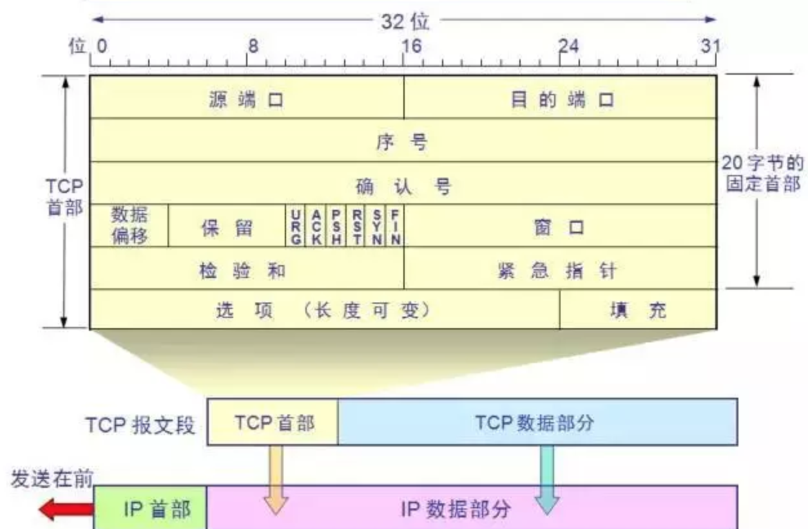

注意：通常情况下，一个正常的TCP连接，都会有三个阶段:1、TCP三次握手;2、数据传送;3、TCP四次挥手

其中在TCP连接和断开连接过程中的关键部分如下：

- 源端口号：即发送方的端口号，在TCP连接过程中，对于客户端，端口号往往由内核分配，无需进程指定；
- 目的端口号：即发送目的的端口号；
- 序号：即为发送的数据段首个字节的序号；
- 确认序号：在收到对方发来的数据报，发送确认时期待对方下一次发送的数据序号；

- SYN：同步序列编号，Synchronize Sequence Numbers；
- ACK：确认编号，Acknowledgement Number；
- FIN：结束标志，FINish；

##### 1、TCP三次握手

三次握手的过程如下： 

- step1. 由客户端向服务器端发起TCP连接请求。Client发送：同步序列编号SYN置为1，发送序号Seq为一个随机数，这里假设为X，确认序号ACK置为0；
- step2. 服务器端接收到连接请求。Server响应：同步序列编号SYN置为1，并将确认序号ACK置为X+1，然后生成一个随机数Y作为发送序号Seq（因为所确认的数据报的确认序号未初始化）；
- step3. 客户端对接收到的确认进行确认。Client发送：将确认序号ACK置为Y+1，然后将发送序号Seq置为X+1（即为接收到的数据报的确认序号）；

为什么是三次握手而不是两次对于step3的作用，假设一种情况，客户端A向服务器B发送一个连接请求数据报，然后这个数据报在网络中滞留导致其迟到了，虽然迟到了，但是服务器仍然会接收并发回一个确认数据报。但是A却因为久久收不到B的确认而将发送的请求连接置为失效，等到一段时间后，接到B发送过来的确认，A认为自己现在没有发送连接，而B却一直以为连接成功了，于是一直在等待A的动作，而A将不会有任何的动作了。这会导致服务器资源白白浪费掉了，因此，两次握手是不行的，因此需要再加上一次，对B发过来的确认再进行一次确认，即确认这次连接是有效的，从而建立连接。

对于双方，发送序号的初始化为何值有的系统中是显式的初始化序号是0，但是这种已知的初始化值是非常危险的，因为这会使得一些黑客钻漏洞，发送一些数据报来破坏连接。因此，初始化序号因为取随机数会更好一些，并且是越随机越安全。

###### 1.Tcpdump抓TCP三次握手抓包分析

```shell
[root@qfedu.com ~]# tcpdump host 192.168.152.3 -i lo and tcp port 8080 
# 接着再运行：
[root@qfedu.com ~]# curl http://192.168.152.3:8080/atbg/doc
```

###### 2.控制台输出

```shell
# TCP三次握手start
16:00:13.486776 IP 192.168.152.3.61725 > 192.168.152.3.8080: Flags [S], seq 1944916150，win 65535，options [mss 16344 ,nop ,wscale 5 , nop,nop,TS val 906474698 ecr O,sackoK,eol], length 0
16:00:13.486850 IP 192.168.152.3.8080 > 192.168.152.3.61725: Flags [S.], seq 1119565918， ack 1944916151, win 65535， options_ [mss 16344 ,nop,wscale 5,nop ,nop,TS val 906474698 ecr 906474698, sackOK, eol], length 0
16:00:13.486860 IP 192.168.152.3.61725 > 192.168.152.3.8080: Flags [.]，ack 1119565919，win 12759，options [nop ,nop,TS val 906474698 ecr 906474698]， length0
16:00:13. 486868 IP 192.168.152.3.8080 > 192.168.152.3.61725: Flags [.], ack 1944916151， win 12759， options [nop ,nop,TS val 906474698 ecr 906474698]， length0
# TCP三次握手end
#传输数据start
16:00:13.486923 IP 192.168.152.3.61725 > 192.168.152..3.8080: Flags [P.], seq 1944916151:1944916238，ack 1119565919, win 12759，options [nop,nop,TS val 906474698 ecr 906474698], length 87: HTTP: GET /atbg/doc HTTP/1.1
16:00:13. .486944 IP 192.168.152.3.8080 > 192.168.152.3.61725: FLags [.]，ack 1944916238, win 12756，options [nop ,nop,TS val 906474698 ecr 906474698]， length0
16:00:13.489750 IP 192.168.152.3.8080 > 192.168.152.3.61725: Flags [P.], seq 1119565919:1119571913, ack 1944916238, win 12756, options [nop , nop，p,ts val 906474701 ecr 906474698]， length 5994: HTTP: HTTP/1.1 200 0K
16:00:13.489784 IP 192.168.152.3.61725 > 192.168.152.3.8080: FLags [.]，ack 1119571913, win 12572, options [nop,nop,TS val 906474701 ecr 906474701]， length❷
#传输数据end
# TCP四次挥手start
16:00:13.490836 IP 192.168.152.3.61725 > 192.168.152.3.8080: Flags_ [F.], seq 1944916238， ack 1119571913，win 12572，options [nop,nop,TS val 906474702 ecr906474701]，length 0
16:00:13490869 IP 192.168.152.3. 8080 > 10.37. 63.3.61725: Flags [.]，ack 1944916239， win 12756, options [nop ,nop,TS val 906474702 ecr 906474702]， length0
16:00:13.490875 IP 192.168.152.3.61725 > 192.168.152.3.8080: Flags [.], ack_ 1119571913, win 12572， options [nop,nop,TS val 906474702 ecr 906474702]， length0
16:00:13.491004 IP 192.168.152.3.8080 > 192.168.152.3.61725: Flags [F.]，seq 1119571913， ack 1944916239，win 12756， options [nop,nop,TS val 906474702 ecr906474702]，length
16:00:13.491081 IP 10.37. 63.3.61725 > 192.168.152.3. 8080: Flags [.]，ack 1119571914, win 12572, options [nop ,nop,TS val 906474702 ecr 906474702]， length0
# TCP四次挥手end
```

每一行中间都有这个包所携带的标志：

- S=SYN，发起连接标志。
- P=PUSH，传送数据标志。
- F=FIN，关闭连接标志。
- ack，表示确认包。
- RST=RESET，异常关闭连接。
- .，表示没有任何标志。

第1行：16:00:13.486776，从192.168.152.3（client）的临时端口61725向192.168.152.3（server）的8080监听端口发起连接，client初始包序号seq为1944916150，滑动窗口大小为65535字节（滑动窗口即tcp接收缓冲区的大小，用于tcp拥塞控制），mss大小为16344（即可接收的最大包长度，通常为MTU减40字节，IP头和TCP头各20字节）。【seq=1944916150，ack=0，syn=1】

第2行：16:00:13.486850，server响应连接，同时带上第一个包的ack信息，为client端的初始包序号seq加1，即1944916151，即server端下次等待接受这个包序号的包，用于tcp字节流的顺序控制。Server端的初始包序号seq为1119565918，mss也是16344。【seq=1119565918，ack=1944916151，syn=1】

第3行：15:46:13.084161，client再次发送确认连接，tcp连接三次握手完成，等待传输数据包。【ack=1119565919，seq=1944916151】

##### 2、TCP四次挥手

连接双方在完成数据传输之后就需要断开连接。由于TCP连接是属于全双工的，即连接双方可以在一条TCP连接上互相传输数据，因此在断开时存在一个半关闭状态，即有有一方失去发送数据的能力，却还能接收数据。因此，断开连接需要分为四次。主要过程如下：

- step1. 主机A向主机B发起断开连接请求，之后主机A进入FIN-WAIT-1状态；
- step2. 主机B收到主机A的请求后，向主机A发回确认，然后进入CLOSE-WAIT状态；
- step3. 主机A收到B的确认之后，进入FIN-WAIT-2状态，此时便是半关闭状态，即主机A失去发送能力，但是主机B却还能向A发送数据，并且A可以接收数据。此时主机B占主导位置了，如果需要继续关闭则需要主机B来操作了；
- step4. 主机B向A发出断开连接请求，然后进入LAST-ACK状态；
- step5. 主机A接收到请求后发送确认，进入TIME-WAIT状态，等待2MSL之后进入CLOSED状态，而主机B则在接受到确认后进入CLOSED状态；

为何主机A在发送了最后的确认后没有进入CLOSED状态，反而进入了一个等待2MSL的TIME-WAIT主要作用有两个：

第一，确保主机A最后发送的确认能够到达主机B。如果处于LAST-ACK状态的主机B一直收不到来自主机A的确认，它会重传断开连接请求，然后主机A就可以有足够的时间去再次发送确认。但是这也只能尽最大力量来确保能够正常断开，如果主机A的确认总是在网络中滞留失效，从而超过了2MSL，最后也无法正常断开；

第二，如果主机A在发送了确认之后立即进入CLOSED状态。假设之后主机A再次向主机B发送一条连接请求，而这条连接请求比之前的确认报文更早地到达主机B，则会使得主机B以为这条连接请求是在旧的连接中A发出的报文，并不看成是一条新的连接请求了，即使得这个连接请求失效了，增加2MSL的时间可以使得这个失效的连接请求报文作废，这样才不影响下次新的连接请求中出现失效的连接请求。

为什么断开连接请求报文只有三个，而不是四个因为在TCP连接过程中，确认的发送有一个延时（即经受延时的确认），一端在发送确认的时候将等待一段时间，如果自己在这段事件内也有数据要发送，就跟确认一起发送，如果没有，则确认单独发送。而我们的抓包实验中，由服务器端先断开连接，之后客户端在确认的延迟时间内，也有请求断开连接需要发送，于是就与上次确认一起发送，因此就只有三个数据报了。

### 3、Wireshark 分析 Tcpdump 抓包结果

#### 1、Tcpdump 抓包

```shell
tcpdump host 10.37.63.3 -i lo and port 8080 -n -w ./Desktop/tcpdump_10.37.63.3_8080_20160525.cap
# 然后再执行curl
curl http://10.37.63.3:8080/atbg/doc
```

#### 2、Wireshark 分析

使用Wireshark打开tcpdump_10.37.63.3_8080_20160525.cap文件

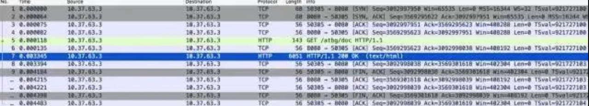

- No. 1-4 行：TCP三次握手环节；
- No. 5-8 行：TCP传输数据环节；
- No. 9-13 行：TCP四次挥手环节；

#### 3、查看 http 请求和响应的方法

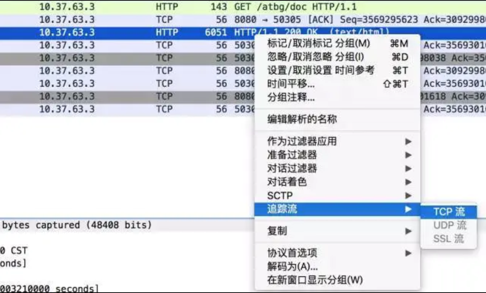

弹窗如下图所示，上面红色部分为请求信息，下面蓝色部分为响应信息：

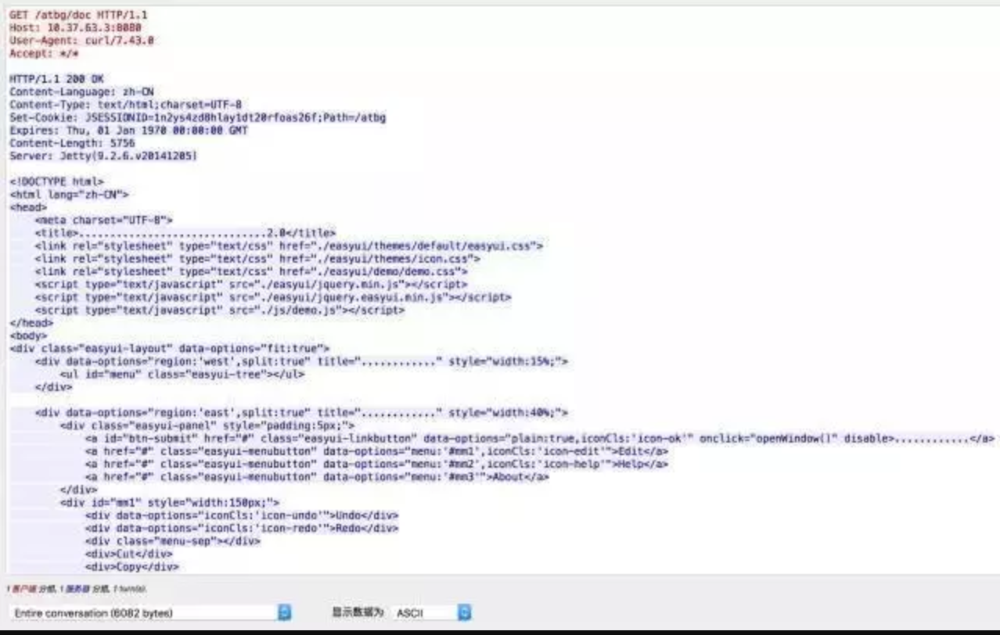

以上是 Wireshark 分析 tcpdump 的简单使用，Wireshark更强大的是过滤器工具，大家可以自行去多研究学习Wireshark.

