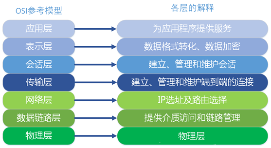

# 第2天-七层负载均衡集群

## 一、Nginx七层的负载均衡

**7层协议**

OSI（Open System Interconnection）是一个开放性的通行系统互连参考模型，他是一个定义的非常好的协议规范，共包含七层协议。直接上图，这样更直观些：



**4层协议**

TCP/IP协议
之所以说TCP/IP是一个协议族，是因为TCP/IP协议包括TCP、IP、UDP、ICMP、RIP、TELNETFTP、SMTP、ARP、TFTP等许多协议，这些协议一起称为TCP/IP协议。

从协议分层模型方面来讲，TCP/IP由四个层次组成：网络接口层、网络层、传输层、应用层。


协议配置

这里我们举例，在nginx做负载均衡，负载多个服务，部分服务是需要7层的，部分服务是需要4层的，也就是说7层和4层配置在同一个配置文件中。

### 1、7层 upstream 模块

```nginx
vim nginx.conf

worker_processes  2;
events {
        worker_connections  1024;
}
# 7层http负载
http {
        include       mime.types;
        default_type  application/octet-stream;
        sendfile        on;
        keepalive_timeout  65;
        gzip  on;

        # app
        upstream  app.com {
                ip_hash;
                server 192.168.152.100:8080;
                server 192.168.152.101:8080;
        }

        server {
                listen       80;
                server_name  app;
                charset utf-8;
                location / {
                        proxy_pass http://plugin.com;
                        proxy_set_header Host $host:$server_port;
                        proxy_set_header X-Real-IP $remote_addr;
                        proxy_set_header X-Forwarded-For $proxy_add_x_forwarded_for;
                }
                error_page   500 502 503 504  /50x.html;
                location = /50x.html {
                        root   html;
                }
        }

        # web
        upstream  web.com {
                ip_hash;
        		server 192.168.152.100:8090;
       		  server 192.168.152.101:8090;
        }
        server {
                listen       81;
                server_name  web;
                charset utf-8;
                location / {
                        proxy_pass http://web.com;
                        proxy_set_header Host $host:$server_port;
                        proxy_set_header X-Real-IP $remote_addr;
                        proxy_set_header X-Forwarded-For $proxy_add_x_forwarded_for;
                }
                error_page   500 502 503 504  /50x.html;
                location = /50x.html {
                        root   html;
                }
        }
}
```

###  2、4 层 stream 模块

nginx 在 1.9.0 的时候，增加了一个 stream 模块，用来实现四层协议（网络层和传输层）的转发、代理、负载均衡等。stream模块的用法跟http的用法类似，允许我们配置一组TCP或者UDP等协议的监听，然后通过proxy_pass来转发我们的请求，通过upstream添加多个后端服务，实现负载均衡。

**注意：stream 模块和 http 模块是一同等级；做四层代理时需要添加上这个模块；**

```nginx
# 4 层 tcp 负载 
stream {
		upstream myweb {
             hash $remote_addr consistent;
             server 192.168.152.100:8080;
             server 192.168.152.101:8080;
        }
        server {
            listen 82;
            proxy_connect_timeout 10s;
            proxy_timeout 30s;
            proxy_pass myweb;
        }
}

# proxy_timeout  30s; #默认值为10分钟，nginx接收后端服务器的响应超时时间
```

**配置 4 层代理**

一台机器测试实验

```nginx
# 配置 4 层代理
# For more information on configuration, see:
#   * Official English Documentation: http://nginx.org/en/docs/
#   * Official Russian Documentation: http://nginx.org/ru/docs/

user nginx;
worker_processes auto;
error_log /var/log/nginx/error.log;
pid /run/nginx.pid;

# Load dynamic modules. See /usr/share/doc/nginx/README.dynamic.
include /usr/share/nginx/modules/*.conf;

events {
    worker_connections 1024;
}

# 配置 4 层代理
stream {
    upstream mytest1 {
        server 192.168.0.100:80;
        server 192.168.0.100:81;
    }
    server {
        listen      192.168.0.108:80;
        proxy_connect_timeout 10s;
        proxy_timeout 30s;
        proxy_pass mytest1;
    }
    upstream mytest2 {
        server 192.168.0.100:3000;
        server 192.168.0.100:3001;
    }
    server {
        listen     192.168.0.108:8080;
        proxy_connect_timeout 10s;
        proxy_timeout 30s;
        proxy_pass mytest2;
    }
}

http {
    log_format  main  '$remote_addr - $remote_user [$time_local] "$request" '
                      '$status $body_bytes_sent "$http_referer" '
                      '"$http_user_agent" "$http_x_forwarded_for"';

    access_log  /var/log/nginx/access.log  main;

    sendfile            on;
    tcp_nopush          on;
    tcp_nodelay         on;
    keepalive_timeout   0;
    types_hash_max_size 2048;

    include             /etc/nginx/mime.types;
    default_type        application/octet-stream;

    # Load modular configuration files from the /etc/nginx/conf.d directory.
    # See http://nginx.org/en/docs/ngx_core_module.html#include
    # for more information.
    include /etc/nginx/conf.d/*.conf;
        server {
                listen 192.168.0.100:80;
                server_name www.test1.com;
                root         /usr/share/nginx/mytest1;
                access_log   /var/log/www.test1.com.log main;
                error_log    /var/log/www.test1.com.error.log;
                set_real_ip_from 192.168.0.108;
                location / {
                }
        }
        server {
                listen 192.168.0.100:81;
                server_name www.test1.com;
                root         /usr/share/nginx/mytest2;
                access_log   /var/log/www.test1.com.log main;
                error_log    /var/log/www.test1.com.error.log;
                set_real_ip_from 192.168.0.108;
                location / {
                }
        }
        server {
                listen 192.168.0.100:3000;
                server_name www.test2.com;
                root         /usr/share/nginx/mytest3;
                access_log   /var/log/www.test2.com.log main;
                error_log    /var/log/www.test2.com.error.log;
                set_real_ip_from 192.168.0.108;
                location / {
                }
        }
        server {
                listen 192.168.0.100:3001;
                server_name www.test2.com;
                root         /usr/share/nginx/mytest4;
                access_log   /var/log/www.test2.com.log main;
                error_log    /var/log/www.test2.com.error.log;
                set_real_ip_from 192.168.0.108;
                location / {
                }
        }
}

```

### 3、负载均衡算法

upstream 支持4种负载均衡调度算法:

A、`轮询(默认)`:每个请求按时间顺序逐一分配到不同的后端服务器; 加权论询

B、`ip_hash`:每个请求按访问IP的hash结果分配，同一个IP客户端固定访问一个后端服务器。可以保证来自同一ip的请求被打到固定的机器上，可以解决session问题。

C、url_hash 按访问url的hash结果来分配请求，使每个url 定向到同一个后端服务器。后台服务器为缓存的时候效率。

D、`fair`:这是比上面两个更加智能的负载均衡算法。此种算法可以依据页面大小和加载时间长短智能地进行负载均衡，也就是根据后端服务器的响应时间来分配请求，响应时间短的优先分配。`Nginx`本身是不支持 `fair`的，如果需要使用这种调度算法，必须下载Nginx的 `upstream_fair`模块。

**配置实例**

#### 1、轮询

nginx默认就是轮询其权重都默认为1，服务器处理请求的顺序：ABABABABAB....

```nginx
upstream myweb { 
      server 192.168.152.100:8080; 
      server 192.168.152.101:8080;      
    }
```

#### 2、加权轮询

跟据配置的权重的大小而分发给不同服务器不同数量的请求。如果不设置，则默认为1。下面服务器的请求顺序为：ABBABBABBABBABB....

```nginx
 upstream myweb { 
      server 192.168.152.100:8080 weight=1;
      server 192.168.152.101:8080 weight=2;
}
# 注意 值越大分配的请求越多
```

#### 3、ip_hash

nginx 会让相同的客户端ip请求相同的服务器。

```nginx
upstream myweb { 
      server 192.168.152.100:8080; 
      server 192.168.152.101:8080;
      ip_hash;
    }
```

#### 4、fair

fair比 weight、ip_hash更加智能的负载均衡算法，fair算法可以根据页面大小和加载时间长短智能地进行负载均衡，也就是根据后端服务器的响应时间 来分配请求，响应时间短的优先分配。Nginx本身不支持fair，如果需要这种调度算法，则必须安装upstream_fair模块。

#### 5、url_hash

按访问的URL的哈希结果来分配请求，使每个URL定向到一台后端服务器，可以进一步提高后端缓存服务器的效率。Nginx本身不支持url_hash，如果需要这种调度算法，则必须安装Nginx的hash软件包。

### 4、nginx负载均衡配置状态参数

- down，表示当前的server暂时不参与负载均衡。
- backup，预留的备份机器。当其他所有的非backup机器出现故障或者忙的时候，才会请求backup机器，因此这台机器的压力最轻。
- max_fails，允许请求失败的次数，默认为1。当超过最大次数时，返回 proxy_next_upstream 模块定义的错误。
- fail_timeout，在经历了max_fails次失败后，暂停服务的时间。max_fails 可以和 fail_timeout一起使用。

```nginx
 upstream myweb { 
      server 192.168.152.100:8080 weight=2 max_fails=2 fail_timeout=2;
      server 192.168.152.101:8080 weight=1 max_fails=2 fail_timeout=1;    
    }
```

## 二、解决失效realserver

如果你的nginx服务器给2台web服务器做代理，负载均衡算法采用轮询，那么当你的一台机器web程序关闭造成web不能访问，那么nginx服务器分发请求还是会给这台不能访问的web服务器，如果这里的响应连接时间过长，就会导致客户端的页面一直在等待响应，对用户来说体验就打打折扣，这里我们怎么避免这样的情况发生呢。这里我配张图来说明下问题。


如果负载均衡中其中web2发生这样的情况，nginx首先会去web1请求，但是nginx在配置不当的情况下会继续分发请求道web2，然后等待web2响应，直到我们的响应时间超时，才会把请求重新分发给web1，这里的响应时间如果过长，用户等待的时间就会越长。

下面的配置是解决方案之一。

```nginx
proxy_connect_timeout 1;   #nginx服务器与被代理的服务器建立连接的超时时间，默认60秒
proxy_read_timeout 1;      #nginx服务器想被代理服务器组发出read请求后，等待响应的超时间，默认为60秒。
proxy_send_timeout 1;       #nginx服务器想被代理服务器组发出write请求后，等待响应的超时间，默认为60秒。
proxy_ignore_client_abort on;  #客户端断网时，nginx服务器是否中断对被代理服务器的请求。默认为off。
```

使用 upstream 指令配置一组服务器作为被代理服务器，服务器中的访问算法遵循配置的负载均衡规则，同时可以使用该指令配置在发生哪些异常情况时，将请求顺次交由下一组服务器处理。

```nginx
proxy_next_upstream timeout;  #反向代理 upstream 中设置的服务器组，出现故障时，被代理服务器返回的状态值。error|timeout|invalid_header|http_500|http_502|http_503|http_504|http_404|off
```

error：建立连接或向被代理的服务器发送请求或读取响应信息时服务器发生错误。

timeout：建立连接，想被代理服务器发送请求或读取响应信息时服务器发生超时。

invalid_header:被代理服务器返回的响应头异常。

off:无法将请求分发给被代理的服务器。

http_400，....:被代理服务器返回的状态码为400，500，502，等。

## 三、七层负载均衡项目实战

> 项目说明：
>
> ​	实现tomcat多实例负载均衡

### 1、Tomcat 多实例部署

**多虚拟主机**：nginx 多个Server标签（域名，ip，端口） 进程数量固定 master+worker

**多实例（多进程）**：同一个程序启动多次，分为两种情况:

第一种：一台机器跑多个站点； 

第二种：一个机器跑一个站点多个实例，配合负载均衡

#### 1、复制程序文件

```shell
[root@qfedu.com ~]# wget https://mirrors.tuna.tsinghua.edu.cn/apache/tomcat/tomcat-8/v8.0.27/bin/apache-tomcat-8.0.27.tar.gz
[root@qfedu.com ~]# cd /application/tools/
[root@qfedu.com ~]# tar xf apache-tomcat-8.0.27.tar.gz
[root@qfedu.com ~]# cp -a apache-tomcat-8.0.27 tomcat8_1
[root@qfedu.com ~]# cp -a apache-tomcat-8.0.27 tomcat8_2
```

#### 2、修改端口，以启动多实例。多实例之间端口不能一致

```shell
[root@qfedu.com ~]# sed -i 's#8005#8011#;s#8080#8081#' tomcat8_1/conf/server.xml
[root@qfedu.com ~]# sed -i 's#8005#8012#;s#8080#8082#' tomcat8_2/conf/server.xml
[root@qfedu.com application]# diff tomcat8_1/conf/server.xml tomcat8_2/conf/server.xml
22c22
< <Server port="8011" shutdown="SHUTDOWN">
---
> <Server port="8012" shutdown="SHUTDOWN">
67c67
<          Define a non-SSL/TLS HTTP/1.1 Connector on port 8081
---
>          Define a non-SSL/TLS HTTP/1.1 Connector on port 8082
69c69
<     <Connector port="8081" protocol="HTTP/1.1"
---
>     <Connector port="8082" protocol="HTTP/1.1"
75c75
<                port="8081" protocol="HTTP/1.1"
---
>                port="8082" protocol="HTTP/1.1"
```

#### 3、将配置好的tomcat程序打包，以备之后使用

```shell
[root@qfedu.com ~]# tar zcf muti_tomcat8.tar.gz ./tomcat8_1 ./tomcat8_2
```

#### 4、启动tomcat多实例

```shell
[root@qfedu.com ~]# /application/tomcat8_1/bin/startup.sh 
[root@qfedu.com ~]# /application/tomcat8_2/bin/startup.sh
```

#### 5、检查端口是否启动

```shell
[root@qfedu.com tomcat8_1]# netstat -lntup |grep java
tcp6   0   0 127.0.0.1:8011    :::*    LISTEN   31906/java
tcp6   0   0 127.0.0.1:8012    :::*    LISTEN   31932/java
tcp6   0   0 :::8080           :::*    LISTEN   31812/java
tcp6   0   0 :::8081           :::*    LISTEN   31906/java
tcp6   0   0 :::8082           :::*    LISTEN   31932/java
tcp6   0   0 127.0.0.1:8005    :::*    LISTEN   31812/java
tcp6   0   0 :::8009           :::*    LISTEN   31812/java
```

#### 6、将每个实例的网页进行区分

```shell
[root@qfedu.com ~]# echo 8081 >>/application/tomcat8_1/webapps/ROOT/index.jsp 
[root@qfedu.com ~]# echo 8082 >>/application/tomcat8_2/webapps/ROOT/index.jsp
```

#### 7、在浏览器访问，进行测试

检查多实例的启动

http://10.0.0.17:8082


http://10.0.0.17:8081


### 2、Tomcat负载均衡集群

#### 1、负载均衡器说明

```shell
[root@qfedu.com ~]# cat /etc/redhat-release 
CentOS release 7.4 (Final)
[root@qfedu.com ~]# uname -a
Linux localhost.localdomain 3.10.0-957.el7.x86_64 #1 SMP Thu Nov 8 23:39:32 UTC 2018 x86_64 x86_64 x86_64 GNU/Linux
[root@qfedu.com ~]# getenforce 
Disabled
[root@qfedu.com ~]# /etc/init.d/iptables status
iptables: Firewall is not running.
```

#### 2、配置负载均衡器

##### 1、备份原配置文件

```shell
[root@qfedu.com ~]# mv  /application/nginx/conf/nginx.conf{,.bak}
[root@qfedu.com ~]# egrep -v '#|^$' /application/nginx/conf/nginx.conf.default  > /application/nginx/conf/nginx.conf
```

##### 2、配置文件内容

```nginx
[root@qfedu.com ~]# cat /application/nginx/conf/nginx.conf
worker_processes  1;
events {
    worker_connections  1024;
}
http {
    include       mime.types;
    default_type  application/octet-stream;
    sendfile        on;
    keepalive_timeout  65;
    upstream web_pools {
        server 10.0.0.17:8081;
        server 10.0.0.17:8082;
    }

    server {
        listen       80;
        server_name  localhost;
        location / {
            root   html;
            index  index.jsp index.htm;
        proxy_pass http://web_pools;
        }
        error_page   500 502 503 504  /50x.html;
        location = /50x.html {
            root   html;
        }
    }
}
```

##### 3、重启nginx服务

```shell
[root@qfedu.com ~]# /application/nginx/sbin/nginx  -s stop 
[root@qfedu.com ~]# /application/nginx/sbin/nginx
```

#### 3、使用命令进行访问测试

使用curl 命令进行测试，tail进行关键字提取

```shell
[root@qfedu.com ~]# curl -s 10.0.0.5|tail -1
8081
[root@qfedu.com ~]# curl -s 10.0.0.5|tail -1
8082
```

使用curl 命令进行测试，awk 进行关键字提取

```shell
[root@qfedu.com ~]# curl -s 10.0.0.5|awk 'END{print}'
8082
[root@qfedu.com ~]# curl -s 10.0.0.5|awk 'END{print}'
8081
```

 使用curl 命令进行测试，sed进行关键字提取

```shell
[root@qfedu.com ~]# curl -s 10.0.0.5|sed -n '$p'
8082
[root@qfedu.com ~]# curl -s 10.0.0.5|sed -n '$p'
8081
```

#### 4、在浏览器上进行访问测试


   建议使用google浏览器chrome 的隐身模式进行访问，使用ctrl+f5 进行强制刷新

## 四、专业负载均衡器Haproxy（扩展）


### 1、HAProxy简介

  官网：http://www.haproxy.com

  HAProxy提供高可用性、负载均衡以及基于TCP和HTTP的应用代理，支持虚拟主机，它是免费、快速并且可靠的一种负载均衡解决方案。适合处理高负载站点的七层数据请求。类似的代理服务可以屏蔽内部真实服务器，防止内部服务器遭受攻击。

#### 1、HAProxy 特点和优点

-   支持原生SSL,同时支持客户端和服务器的SSL.
-   支持IPv6和UNIX套字节（sockets）
-   支持HTTP Keep-Alive
-   支持HTTP/1.1压缩，节省宽带
-   支持优化健康检测机制（SSL、scripted TCP、check agent...）
-   支持7层负载均衡。
-   可靠性和稳定性非常好。
-   并发连接40000-50000个，单位时间处理最大请求20000个，最大数据处理10Gbps.
-   支持8种负载均衡算法，同时支持session保持。
-   支持虚拟主机。
-   支持连接拒绝、全透明代理。
-   拥有服务器状态监控页面。
-   支持ACL.

#### 2、 HAProxy 保持会话

HAProxy为了让同一客户端访问服务器可以保持会话。有三种解决方法：客户端IP、Cookie以及Session

- HAProxy通过客户端IP进行Hash计算并保存，以此确保当相同IP访问代理服务器可以转发给固定的真实服务器。

- HAProxy依靠真实服务器发送客户端的Cookie信息进行会话保持。

- HAProxy将保存真实服务器的Session以及服务器标识，实现会话保持。

  （HAProxy只要求后端服务器能够在网络联通，也没有像LVS那样繁琐的ARP配置）

#### 3、HAProxy 负载均衡算法

-  HAProxy的balance8种负载均衡算法：
   roundrobin : 基于权重轮循。
-  static-rr : 基于权重轮循。静态算法，运行时改变无法生效
-  source : 基于请求源IP的算法。对请求的源IP进行hash运算，然后将结果与后端服务器的权重总数想除后转发至某台匹配服务器。使同一IP客户端请求始终被转发到某特定的后端服务器。
-  leastconn : 最小连接。（适合数据库负载均衡，不适合会话短的环境） 
-  uri : 对部分或整体URI进行hash运算，再与服务器的总权重想除，最后转发到匹配后端。
-  uri_param : 根据URL路径中参数进行转发，保证在后端服务器数量不变的情况下，同一用户请求分发到同一机器。
-  hdr(<name>) : 根据http头转发，如果不存在http头。则使用简单轮循。

####  4、HAProxy主要工作模式

-   tcp模式:该模式下，在客户端和服务器之间将建立一个全双工的连接，且不会对7层的报文做任何处理的简单模式。此模式默认，通常用于SSL、SSH、SMTP应用。
-   http模式（一般使用）：该模式下，客户端请求在转发给后端服务器之前会被深度分析，所有不与RFC格式兼容的请求都会被拒绝。  

### 2、HAProxy 安装及配置文件参数

#### 1、HAProxy 安装

```shell
[root@qfedu.com ~]# yum -y install haproxy
```

#### 2、HAProxy 环境

haproxy 的配置文件通常分为三部分: 

- global（全局配置部分） 
- defaults（默认配置部分） 
- listen(应用组件部分)

##### 1、 HAProxy 配置文件详解

```shell
[root@qfedu.com ~]# vim /etc/haproxy/haproxy.cfg

       ####################全局配置####################### 
       #######参数是进程级的，通常和操作系统（OS）相关######### 
global 
       maxconn 20480                   # 默认最大连接数 
       log 127.0.0.1 local0            # 日志输出配置，所有日志都记录在本机系统日志，通过local0输出
       log 127.0.0.1 local1 notice     # notice 为日志级别，通常有24个级别（error warringinfo debug）
       chroot /var/haproxy             # chroot运行的路径 
       uid 99                          # 所属运行的用户uid 
       gid 99                          # 所属运行的用户组 
       daemon                          # 以后台形式运行haproxy 
       nbproc 1                        # 进程数量(可以设置多个进程提高性能) 
       pidfile /var/run/haproxy.pid    # haproxy的pid存放路径,启动进程的用户必须有权限访问此文件 
       ulimit-n 65535                  # ulimit的数量限制 
       #####################默认设置###################### 
       ##这些参数可以被利用配置到frontend，backend，listen组件## 
defaults 
       log global 
       mode http                       # 所处理的类别 (#7层 http;4层tcp  ) 
       maxconn 20480                   # 最大连接数 
       option httplog                  # 日志类别http日志格式 
       option httpclose                # 每次请求完毕后主动关闭http通道 
       option dontlognull              # 不记录健康检查的日志信息 
       option forwardfor               # 如果后端服务器需要获得客户端真实ip需要配置的参数，可以从Http Header中获得客户端ip  
       option redispatch               # serverId对应的服务器挂掉后,强制定向到其他健康的服务器  
       option abortonclose             # 当服务器负载很高的时候，自动结束掉当前队列处理比较久的连接 
       stats refresh 30                # 统计页面刷新间隔 
       retries 3                       # 3次连接失败就认为服务不可用，也可以通过后面设置 
       balance roundrobin              # 默认的负载均衡的方式,轮询方式 
      #balance source                  # 默认的负载均衡的方式,类似nginx的ip_hash 
      #balance leastconn               # 默认的负载均衡的方式,最小连接 
       contimeout 5000                 # 连接超时 
       clitimeout 50000                # 客户端超时 
       srvtimeout 50000                # 服务器超时 
       timeout check 2000              # 心跳检测超时 
       ####################监控页面的设置####################### 
listen admin_status                    # Frontend和Backend的组合体,监控组的名称，按需自定义名称 
        bind 0.0.0.0:65532             # 监听端口 
        mode http                      # http的7层模式 
        log 127.0.0.1 local3 err       # 错误日志记录 
        stats refresh 5s               # 每隔5秒自动刷新监控页面 
        stats uri /admin?stats         # 监控页面的url 
        stats realm itnihao\ itnihao   # 监控页面的提示信息 
        stats auth admin:admin         # 监控页面的用户和密码admin,可以设置多个用户名 
        stats auth admin1:admin1       # 监控页面的用户和密码admin1 
        stats hide-version             # 隐藏统计页面上的HAproxy版本信息  
        stats admin if TRUE            # 手工启用/禁用,后端服务器(haproxy-1.4.9以后版本) 
       errorfile 403 /etc/haproxy/errorfiles/403.http 
       errorfile 500 /etc/haproxy/errorfiles/500.http 
       errorfile 502 /etc/haproxy/errorfiles/502.http 
       errorfile 503 /etc/haproxy/errorfiles/503.http 
       errorfile 504 /etc/haproxy/errorfiles/504.http 
       #################HAProxy的日志记录内容设置################### 
       capture request  header Host           len 40 
       capture request  header Content-Length len 10 
       capture request  header Referer        len 200 
       capture response header Server         len 40 
       capture response header Content-Length len 10 
       capture response header Cache-Control  len 8 
       #######################网站监测listen配置##################### 
       ###########此用法主要是监控haproxy后端服务器的监控状态############ 
listen site_status 
       bind 0.0.0.0:1081                    # 监听端口 
       mode http                            # http的7层模式 
       log 127.0.0.1 local3 err             # [err warning info debug] 
       monitor-uri /site_status             # 网站健康检测URL，用来检测HAProxy管理的网站是否可以用，正常返回200，不正常返回503 
       acl site_dead nbsrv(server_web) lt 2 # 定义网站down时的策略当挂在负载均衡上的指定backend的中有效机器数小于1台时返回true 
       acl site_dead nbsrv(server_blog) lt 2 
       acl site_dead nbsrv(server_bbs)  lt 2  
       monitor fail if site_dead            # 当满足策略的时候返回503，网上文档说的是500，实际测试为503 
       monitor-net 192.168.16.2/32          # 来自192.168.16.2的日志信息不会被记录和转发 
       monitor-net 192.168.16.3/32 
       ######################frontend配置######################### 
       #####注意，frontend配置里面可以定义多个acl进行匹配操作########### 
frontend http_80_in 
       bind 0.0.0.0:80      # 监听端口，即haproxy提供web服务的端口，和lvs的vip端口类似 
       mode http            # http的7层模式 
       log global           # 应用全局的日志配置 
       option httplog       # 启用http的log 
       option httpclose     # 每次请求完毕后主动关闭http通道，HA-Proxy不支持keep-alive模式 
       option forwardfor    # 如果后端服务器需要获得客户端的真实IP需要配置次参数，将可以从Http Header中获得客户端IP 
       ########################acl策略配置######################## 
       acl itnihao_web hdr_reg(host) -i ^(www.itnihao.cn|ww1.itnihao.cn)$    
       # 如果请求的域名满足正则表达式中的2个域名返回true -i是忽略大小写 
       acl itnihao_blog hdr_dom(host) -i blog.itnihao.cn 
       # 如果请求的域名满足www.itnihao.cn返回true -i是忽略大小写 
       # acl itnihao    hdr(host) -i itnihao.cn 
       # 如果请求的域名满足itnihao.cn返回true -i是忽略大小写 
       # acl file_req url_sub -i  killall= 
       # 在请求url中包含killall=，则此控制策略返回true,否则为false 
       # acl dir_req url_dir -i allow 
       # 在请求url中存在allow作为部分地址路径，则此控制策略返回true,否则返回false 
       # acl missing_cl hdr_cnt(Content-length) eq 0 
       # 当请求的header中Content-length等于0时返回true 
       ##########################acl策略匹配相应################## 
       # block if missing_cl 
       # 当请求中header中Content-length等于0阻止请求返回403 
       # block if !file_req || dir_req 
       # block表示阻止请求，返回403错误，当前表示如果不满足策略file_req，或者满足策略dir_req，则阻止请求 
       use_backend  server_web  if itnihao_web 
       # 当满足itnihao_web的策略时使用server_web的backend 
       use_backend  server_blog if itnihao_blog 
       # 当满足itnihao_blog的策略时使用server_blog的backend 
       # redirect prefix http://blog.itniaho.cn code 301 if itnihao 
       # 当访问itnihao.cn的时候，用http的301挑转到http://192.168.16.3 
       default_backend server_bbs 
       # 以上都不满足的时候使用默认server_bbs的backend 
       ########################backend的设置#################### 
       #下面我将设置三组服务器 server_web，server_blog，server_bbs
###########################backend server_web############################# 
backend server_web 
       mode http            # http的7层模式 
       balance roundrobin   # 负载均衡的方式，roundrobin平均方式 
       cookie SERVERID      # 允许插入serverid到cookie中，serverid后面可以定义 
       option httpchk GET /index.html # 心跳检测的文件 
       server web1 192.168.16.2:80 cookie web1 check inter 1500 rise 3 fall 3 weight 1  
       # 服务器定义，cookie 1表示serverid为web1，check inter 1500是检测心跳频率rise 3是3次正确认为服务器可用， 
       # fall 3是3次失败认为服务器不可用，weight代表权重 
       server web2 192.168.16.3:80 cookie web2 check inter 1500 rise 3 fall 3 weight 2 
       # 服务器定义，cookie 1表示serverid为web2，check inter 1500是检测心跳频率rise 3是3次正确认为服务器可用， 
       # fall 3是3次失败认为服务器不可用，weight代表权重 
###################################backend server_blog############################################### 
backend server_blog 
       mode http            # http的7层模式 
       balance roundrobin   # 负载均衡的方式，roundrobin平均方式 
       cookie SERVERID      # 允许插入serverid到cookie中，serverid后面可以定义 
       option httpchk GET /index.html # 心跳检测的文件 
       server blog1 192.168.16.2:80 cookie blog1 check inter 1500 rise 3 fall 3 weight 1  
       # 服务器定义，cookie 1表示serverid为web1，check inter 1500是检测心跳频率rise 3是3次正确认为服务器可用，fall 3是3次失败认为服务器不可用，weight代表权重 
       server blog2 192.168.16.3:80 cookie blog2 check inter 1500 rise 3 fall 3 weight 2 
        # 服务器定义，cookie 1表示serverid为web2，check inter 1500是检测心跳频率rise 3是3次正确认为服务器可用，fall 3是3次失败认为服务器不可用，weight代表权重 
###################################backend server_bbs############################################### 
backend server_bbs 
       mode http            # http的7层模式 
       balance roundrobin   # 负载均衡的方式，roundrobin平均方式 
       cookie SERVERID      # 允许插入serverid到cookie中，serverid后面可以定义 
       option httpchk GET /index.html # 心跳检测的文件 
       server bbs1 192.168.16.2:80 cookie bbs1 check inter 1500 rise 3 fall 3 weight 1  
       # 服务器定义，cookie 1表示serverid为web1，check inter 1500是检测心跳频率rise 3是3次正确认为服务器可用，fall 3是3次失败认为服务器不可用，weight代表权重 
       server bbs2 192.168.16.3:80 cookie bbs2 check inter 1500 rise 3 fall 3 weight 2 
       # 服务器定义，cookie 1表示serverid为web2，check inter 1500是检测心跳频率rise 3是3次正确认为服务器可用，fall 3是3次失败认为服务器不可用，weight代表权重 
```

### 3、Haproxy 实现七层负载

```shell
Keepalived + Haproxy
=================================================================================

[root@qfedu.com. ~]# vim /etc/haproxy/haproxy.cfg
global												      #关于进程的全局参数
    log         		    127.0.0.1 local2
    chroot      		/var/lib/haproxy
    pidfile     		    /var/run/haproxy.pid
    maxconn     	4000
    user        		    haproxy
    group       	    haproxy
    daemon			

defaults、listen、frontend、backend　# 关于Proxy配置段
defaults # 段用于为其它配置段提供默认参数
listen是frontend和backend的结合体

frontend        # 虚拟服务VIrtual Server      监听器             接受访问并调度
backend         # 真实服务器Real Server       Web Servers       被调度的服务器

# 调度器可以同时为多个站点调度，如果使用frontend、backend的方式：
frontend1 backend1
frontend2 backend2
frontend3 backend3
```

```shell
Keepalived + Haproxy
=================================================================================


拓扑结构

							[vip: 192.168.122.100]

						[LB1 Haproxy]		[LB2 Haproxy]
						192.168.122.2	    192.168.122.3

				  [httpd]				 [httpd]		   [httpd]
				192.168.122.10		192.168.122.20		192.168.122.30
				

一、Haproxy实施步骤				
1. 准备工作（集群中所有主机）
IP, hostname, hosts, iptables, SELinux, ssh trust, ntp	
[root@qfedu.com. ~]# cat /etc/hosts
127.0.0.1      	localhost
192.168.122.2	director1.qfedu.com active
192.168.122.3	director2.qfedu.com backup
192.168.122.10	node1.qfedu.com node1 
192.168.122.20	node2.qfedu.com node2
192.168.122.30	node2.qfedu.com node3

2. RS配置
配置好网站服务器，测试所有RS	

3. 调度器配置Haproxy（主/备）
[root@qfedu.com. ~]# yum -y install haproxy	
[root@qfedu.com. ~]# cp -rf /etc/haproxy/haproxy.cfg{,.bak}
[root@qfedu.com. ~]# sed -i -r '/^[ ]*#/d;/^$/d' /etc/haproxy/haproxy.cfg
[root@qfedu.com. ~]# vim /etc/haproxy/haproxy.cfg
global
...
defaults
...

----------------------------配置监控[可选]------------------------------
listen stats
    bind                    	*:1314
    stats                   	enable
    stats refresh 		30s
    stats                   	hide-version
    stats uri              	/haproxystats
    stats realm         	Haproxy\ stats
    stats auth           	qfedu:123
    stats admin         if TRUE
----------------------------------------------------------------------

frontend web
    mode                   	http
    bind                    	    *:80
    default_backend    httpservers

backend httpservers
    balance roundrobin
    server http1 192.168.122.10:80 maxconn 2000 weight 1  check inter 1s rise 2 fall 2
    server http2 192.168.122.20:80 maxconn 2000 weight 1  check inter 1s rise 2 fall 2
    server http3 192.168.122.30:80 maxconn 2000 weight 1  check inter 1s rise 2 fall 2
    
[root@qfedu.com. ~]# service haproxy restart
[root@qfedu.com. ~]# chkconfig haproxy on
```

4. 测试调度器(主/备)


```shell
Keepalived 实现调度器 HA
注：主/备调度器均能够实现正常调度
1. 主/备调度器安装软件
[root@master.qfedu.com ~]# yum -y install keepalived 
[root@backup.qfedu.com ~]# yum -y install keepalived 

2. Keepalived
Master 
[root@master.qfedu.com ~]# vim /etc/keepalived/keepalived.conf
! Configuration File for keepalived

global_defs {
   router_id director1			 # 辅助改为director2
}

vrrp_instance VI_1 {
    state BACKUP
    nopreempt				
    interface eth0				# 心跳接口，尽量单独连接心跳
    virtual_router_id 80		# MASTER,BACKUP一致
    priority 100			    # 辅助改为50
    advert_int 1
    authentication {
        auth_type PASS
        auth_pass 1111
    }
    virtual_ipaddress {
        192.168.122.100
    }
}

BACKUP

3. 启动KeepAlived（主备均启动）
[root@backup.qfedu.com ~]# systemctl enable keeplived 
[root@backup.qfedu.com ~]# systemctl start keepalived
[root@backup.qfedu.com ~]# ip addr


4. 扩展对调度器Haproxy健康检查（可选）
思路：
让Keepalived以一定时间间隔执行一个外部脚本，脚本的功能是当Haproxy失败，则关闭本机的Keepalived
a. script
[root@master.qfedu.com ~]# cat /etc/keepalived/check_haproxy_status.sh
#!/bin/bash											        	
/usr/bin/curl -I http://localhost &>/dev/null	
if [ $? -ne 0 ];then									    	
	/etc/init.d/keepalived stop					    	
fi															        	
[root@master.qfedu.com ~]# chmod a+x /etc/keepalived/check_haproxy_status.sh

b. keepalived使用script
! Configuration File for keepalived

global_defs {
   router_id director1
}

vrrp_script check_haproxy {
   script "/etc/keepalived/check_haproxy_status.sh"
   interval 5
}

vrrp_instance VI_1 {
    state BACKUP
    interface eth0
    nopreempt
    virtual_router_id 90
    priority 100
    advert_int 1
    authentication {
        auth_type PASS
        auth_pass qfedu
    }
    virtual_ipaddress {
        192.168.122.100
    }

    track_script {
        check_haproxy
    }
}

=================================================================================


listen www.qfedu.com
    mode               http
    bind                *:80
    balance roundrobin
    #balance source
    server http1 192.168.122.10:80 maxconn 2000 weight 1  check inter 1s rise 2 fall 2
    server http2 192.168.122.20:80 maxconn 2000 weight 1  check inter 1s rise 2 fall 2
    server http3 192.168.122.30:80 maxconn 2000 weight 1  check inter 1s rise 2 fall 2

Haproxy Log:
[root@rhel6 ~]# tcpdump -i lo -nn port 514
tcpdump: verbose output suppressed, use -v or -vv for full protocol decode
listening on lo, link-type EN10MB (Ethernet), capture size 65535 bytes
02:48:50.475524 IP 127.0.0.1.41350 > 127.0.0.1.514: SYSLOG local2.info, length: 176
02:48:55.479321 IP 127.0.0.1.41350 > 127.0.0.1.514: SYSLOG local2.info, length: 176
02:49:00.479946 IP 127.0.0.1.41350 > 127.0.0.1.514: SYSLOG local2.info, length: 176
02:49:05.476149 IP 127.0.0.1.41350 > 127.0.0.1.514: SYSLOG local2.info, length: 176
02:49:10.473743 IP 127.0.0.1.41350 > 127.0.0.1.514: SYSLOG local2.info, length: 176
02:49:15.481521 IP 127.0.0.1.41350 > 127.0.0.1.514: SYSLOG local2.info, length: 176

[root@master.qfedu.com ~]# netstat -tunlp |grep :514


[root@master.qfedu.com ~]# vim /etc/sysconfig/rsyslog
SYSLOGD_OPTIONS="-c 2 -r"

[root@master.qfedu.com ~]# vim /etc/rsyslog.conf
# Provides UDP syslog reception
$ModLoad imudp
$UDPServerRun 514

# Provides TCP syslog reception
$ModLoad imtcp
$InputTCPServerRun 514

local2.*                       /var/log/haproxy.log

[root@master.qfedu.com ~]# systemctl restart rsyslog


[root@master.qfedu.com ~]# netstat -tunlp |grep :514
tcp        0      0 0.0.0.0:514                 0.0.0.0:*                   LISTEN      2755/rsyslogd       
tcp        0      0 :::514                      :::*                        LISTEN      2755/rsyslogd       
udp        0      0 0.0.0.0:514                 0.0.0.0:*                               2755/rsyslogd       
udp        0      0 :::514                      :::*                                    2755/rsyslogd  

[root@master.qfedu.com ~]# tailf /var/log/haproxy.log 
Jan 16 02:51:10 localhost haproxy[2734]: [16/Jan/2016:02:51:10.487] www.qfedu.com www.qfedu.com/http3 0/0/0/0/0 200 265 - - ---- 1/1/0/1/0 0/0 "HEAD / HTTP/1.1"
Jan 16 02:51:15 localhost haproxy[2734]: [16/Jan/2016:02:51:15.493] www.qfedu.com www.qfedu.com/http1 0/0/0/1/1 200 265 - - ---- 1/1/0/1/0 0/0 "HEAD / HTTP/1.1"
Jan 16 02:51:20 localhost haproxy[2734]: [16/Jan/2016:02:51:20.490] www.qfedu.com www.qfedu.com/http2 0/0/0/1/1 200 265 - - ---- 1/1/0/1/0 0/0 "HEAD / HTTP/1.1"


主/备调度器：
正常只有活跃的调度器发送组播
[root@master.qfedu.com ~]# tcpdump -i eth0 -nn vrrp
tcpdump: verbose output suppressed, use -v or -vv for full protocol decode
listening on eth0, link-type EN10MB (Ethernet), capture size 65535 bytes
02:13:38.483890 IP 192.168.122.56 > 224.0.0.18: VRRPv2, Advertisement, vrid 88, prio 100, authtype simple, intvl 1s, length 20
02:13:39.484731 IP 192.168.122.56 > 224.0.0.18: VRRPv2, Advertisement, vrid 88, prio 100, authtype simple, intvl 1s, length 20
02:13:40.487664 IP 192.168.122.56 > 224.0.0.18: VRRPv2, Advertisement, vrid 88, prio 100, authtype simple, intvl 1s, length 20
02:13:41.488244 IP 192.168.122.56 > 224.0.0.18: VRRPv2, Advertisement, vrid 88, prio 100, authtype simple, intvl 1s, length 20
02:13:42.489277 IP 192.168.122.56 > 224.0.0.18: VRRPv2, Advertisement, vrid 88, prio 100, authtype simple, intvl 1s, length 20
02:13:43.490422 IP 192.168.122.56 > 224.0.0.18: VRRPv2, Advertisement, vrid 88, prio 100, authtype simple, intvl 1s, length 20
02:13:44.491214 IP 192.168.122.56 > 224.0.0.18: VRRPv2, Advertisement, vrid 88, prio 100, authtype simple, intvl 1s, length 20
02:13:45.491975 IP 192.168.122.56 > 224.0.0.18: VRRPv2, Advertisement, vrid 88, prio 100, authtype simple, intvl 1s, length 20
02:13:46.492977 IP 192.168.122.56 > 224.0.0.18: VRRPv2, Advertisement, vrid 88, prio 100, authtype simple, intvl 1s, length 20
02:13:47.494123 IP 192.168.122.56 > 224.0.0.18: VRRPv2, Advertisement, vrid 88, prio 100, authtype simple, intvl 1s, length 20
```

### 4、Haproxy 实现四层负载

```
Haproxy L4
=================================================================================

global
    log                     127.0.0.1 local2
    chroot                /var/lib/haproxy
    pidfile                 /var/run/haproxy.pid
    maxconn            4000
    user                   haproxy
    group                 haproxy
    daemon
    
defaults
    mode                  http
    log                      global
    option                 dontlognull
    retries                 3
    maxconn             3000
    contimeout          50000
    clitimeout            50000
    srvtimeout           50000

listen stats
    bind                    *:1314
    stats                   enable
    stats                   hide-version
    stats uri               /haproxystats
    stats realm          Haproxy\ stats
    stats auth            qfedu:123
    stats admin          if TRUE

frontend web
    option                   httplog
    option                   http-server-close
    option forwardfor   except 127.0.0.0/8
   #option                  redispatch
    mode                    http
    bind                      *:80
    default_backend    httpservers

backend httpservers
    balance roundrobin
    server http1 192.168.122.10:80 check maxconn 2000
    server http2 192.168.122.20:80 check maxconn 2000
    server http3 192.168.122.30:80 check maxconn 2000

listen mysql
    bind *:3306
    mode tcp
    balance roundrobin
    server mysql1 192.168.122.40:3306 weight 1  check inter 1s rise 2 fall 2
    server mysql2 192.168.122.50:3306 weight 1  check inter 1s rise 2 fall 2
    server mysql3 192.168.122.60:3306 weight 1  check inter 1s rise 2 fall 2

=================================================================================    

```


